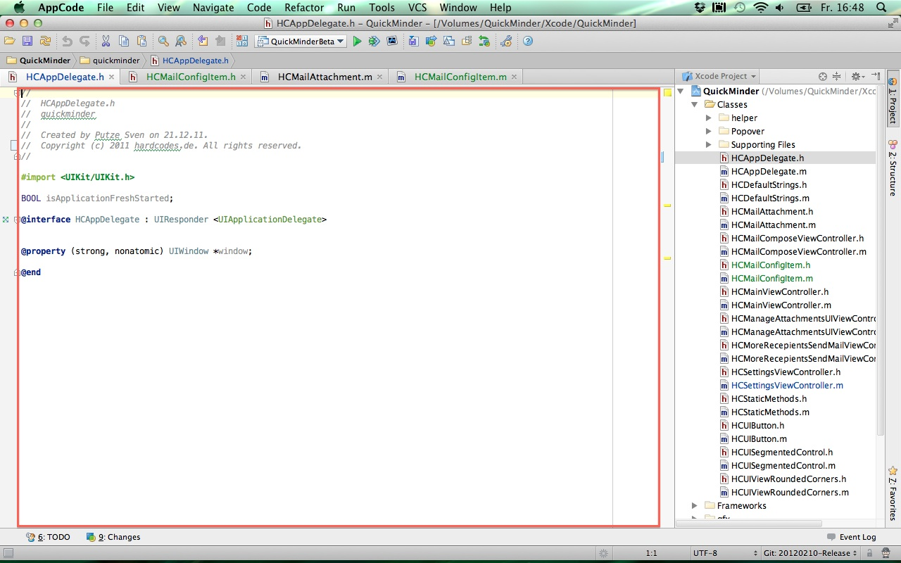

# I need space #

There is this fruity company from Cupertino, giving a development environment to the people, called Xcode. It's free (as in free beer not as in free speech). It's buggy (sorry to say that - but it really is) and I often wonder if any of the people at Apple HQ ever tried to use it on a Macbook pro 13"?

As of today it is still buyable hardware on their store, so they should have tried it. What I am ranting about is this:

Now compare this to AppCode:

You get the difference, don't you?

Yes, I could use those buttons in the upper right corner to get more space in the editor. And ten seconds after that I may need the left or right pane again, move the mouse pointer all the way up and change it back. Then I need more space...

And for the clever ones mumbling something like keyboard shortcut: have you ever tried those on a German keyboard? Vulcans may like that, I do not!