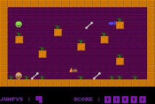
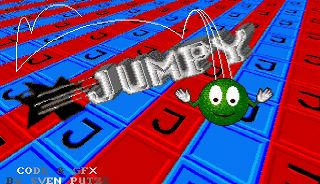

# Jumpy on Amiga #

Jumpy is quite old, you know. Back in the year 1989 it began jumping around on the world famous Amiga. Now that name was blocked in the iTunes AppStore® so Jumpy got JumpyRally.

I had started Jumpy as a personal "science" project back in school. It served my well in learning assembler for the Motorola 68000. One lesson was "do not use hardcoded values". And there you go: it's the perfect name for this site.