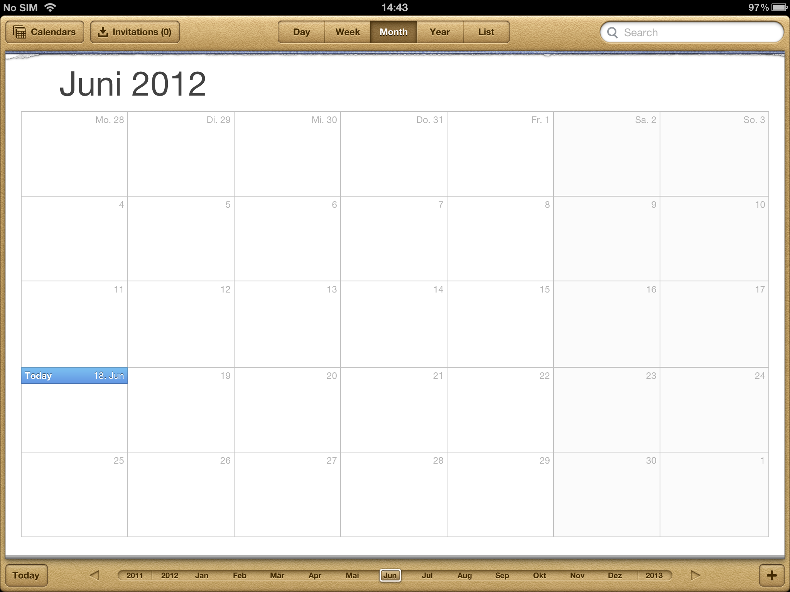
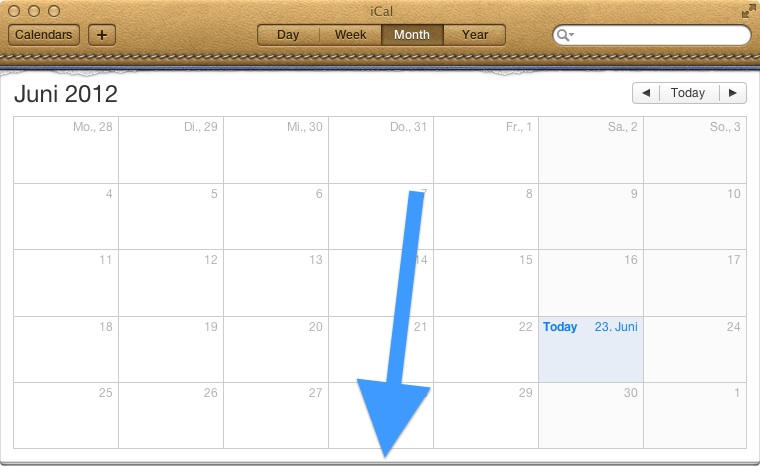

# Back to the Mac #

In the year 2010 Apple announced "Back to the Mac" and with OSX Lion came iCloud and some Apps in iOS Design.
Calendar is one of them.

Despite liking the leather design or not, someone tell me please why they can't copy the full UI?

Why does the OSX version lack of the "select the month" bar?

Why is the "today" button on a completely different position?

If merging iOS and OSX Apps is the new paradigm, please be consistant at last.
