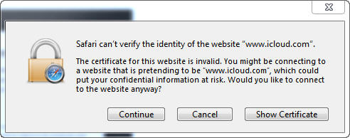
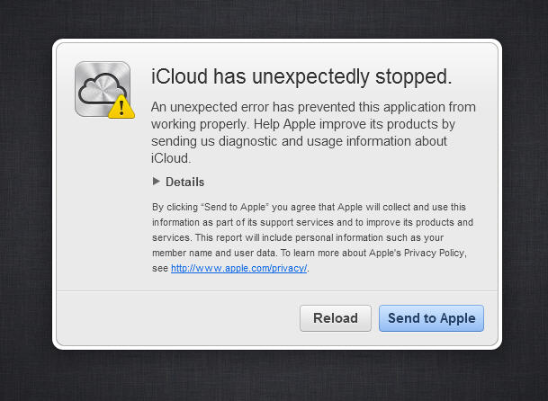

# Trust the cloud #

Since one week I'm getting this at work:

Well, I hope my data is safe with Apple since it can not be accessed 8). Joking aside that just happens with Apple's (latest) Safari browser for Windows, Firefox works (and that is extraordinary, or should I say magic?).

They got too fast too big I fear.

Maybe the problem is caused by some Microsoft security updates - there was same trouble regarding certificates lately. But Apple should be aware of this if they build Software for the Windows platform.

***Update***

The problem is caused by the SSL gateway that is used in our company. That little thingy basically works like a man-in-the-middle attack and sniffs into the network traffic for viruses. Therefore it issues a new certificate that is sent to the browser. The browser will accept the new certificate because it was fed with the root certificate of the SSL gateway. Since this works fine with IE and Firefox I still think it a bug in Safari, because it doesn't even show the certificate path.