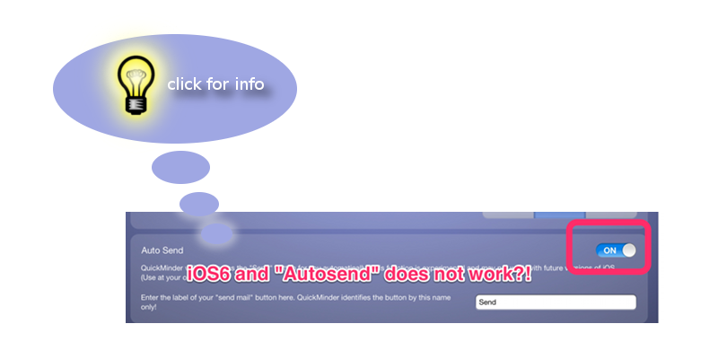

# QuickMinder and iOS6, game over? #

You've upgraded your iPod, iPhone or iPad to iOS6 and now the "Autosend" feature of QuickMinder doesn't work anymore?

Well, bad luck! Blame Apple and not me. For some obscure reasons they've raised the bar of "security" to a new level. But this time it isn't really about security, they don't want that the mail view in iOS can be used this way. This is not by accident, Apple *invented* bad user & developer treatment.

If you've bought QuickMinder, I am very thankful for that! But I am sorry to tell you, that Apple has made it impossible to reactivate this feature ever again! This is sad for you, because I think it was a very useful feature in QuickMinder and made life easier. It's sad for me (sad is not the right word, but more polite) and made me come to the only decision that is appropriate here: I will stop developing for iOS. In the end that doesn't hurt Apple and it doesn't hurt me.

Game over!