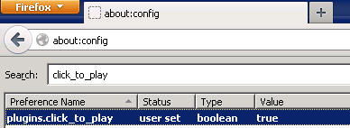

# Useless features

In the last weeks there were some severe security breaches in the Java world. Most of them had in common that a Java applet was started using a browser on a prepared website. Personally I've switched of the use of Java applets on all machines/browsers, so I should be quite safe.

Today I've stumbled upon a feature in Firefox: `click_to_play`  --- it's not so very hot and new as a little googleing showed.

This tiny little boolean controls whether Firefox starts plugins etc. while browsing the web.

So, I didn't know about this feature. Why? Because you have to dive into that longish about:config page that controls/shows the Firefox settings behind the scene. Behind the scene is all my today's rant is about: make it default AND make a checkbox somewhere on the security tab in the options/preferences. You'd be surprised: users could use that feature. And it's spelled USErs.
