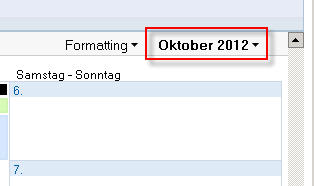
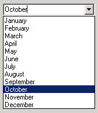
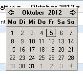
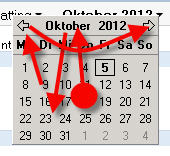

# Daily UI hell #

In our company we use Lotus Notes (yeah, pity me now). Not only is Lotus Notes an ugly email client it is also used for collaboration, which goes for me as far as using a calendar.

Now what do you think if you can see this? (just ignore the German names here for a little moment)

I don't know what you think but I think of a dropdown box. Using Windows since version 3.11 (and knowing since version 2) and many other graphical user interfaces some sort of conditioning took place. If I see that little downwards looking arrow on the right side, I am sure there is a dropdown box hiding.

And it would make perfectly sense here: you often need to change the month (quickly) and 12 months = 12 items that fit well in a dropdown box. That would even work on VGA standard resolution.
Knowing and expecting that my eyes focus the area under the GUI element.

Then a click...

Bazinga!

I'm getting a tiny calendar.

The eyes start looking for orientation, perceive the current month on top of the box (that isn't even exactly under the previous GUI element. It partly hides it and is slightly shifted to the left), jump back to the calendar.
Where are my months?

Cognition.

The arrows on the upper left and right are for flipping to the previous or next month. In my eyes this little task got already complicated for exactly that purpose: flipping to the previous or the next month.

But what if I want to skip several months?

click, clickedy, click, click.

Sorry folks, but what in the name of did the designers of Lotus Notes think here?
And now think again about the German names for days and months. Oh, how can I express my deep love for this kind of software?
