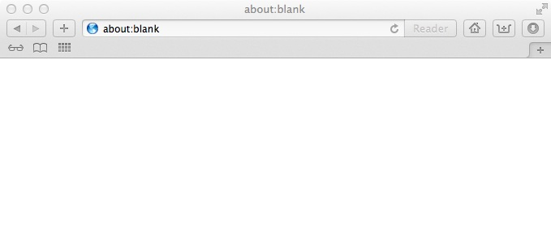

# Old habits #

With my iPad came the "need" for the iCloud and at this point I started using Apple's Safari browser. Being a "switcher" from Windows I was used to Internet Explorer and much more to Firefox. The latter was my browser of choice when I entered the universe of Jobs. But synchronizing the bookmarks between the iPad and my desktop computer made totally sense, so I gave Safari a try.

Nope, this is not about which browser is better or the best at all.

It's about some GUI detail that took me by surprise.

So this was Safari after all. Not so unusual, isn't it? Besides having the bookmarks on the desktop, too, it felt like it should. Hey it's a browser, not the holy grail.
Until...

...I wanted to search something in Google. Simple enough, one could think. Yes, but...

...where is the textfield for the search term?

Where should I enter what I was looking for?

Lacking any alternative I entered the words in the URL bar and voilá I was in Google.
And of course, it is so simple to differ betweens URLs and search terms, just using a regex.

What really struck me was the question "why on earth have so many browsers two textfields for that?"
Because there work geniuses at Apple?

Well, have you seen Safari on IOS? These little devices with really small screen real estate? One should think that these are exactly the kind of devices that have born the idea of just using one textfield. And then they brought it "Back To The Mac".

Look for yourself:

