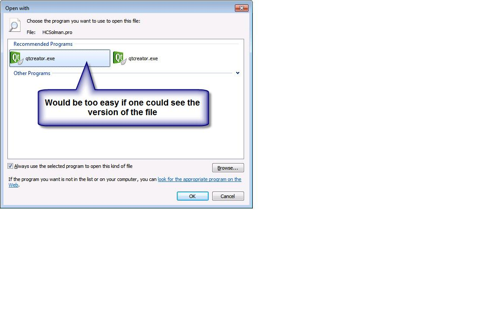

# Open with... #

Today I was trying to compile a Qt test project with an external library and the issues kept on coming. Not bad for 4 lines of code...

But then I remembered being there before: maybe the wrong toolchain was set up for this project.

Yes, indeed: MinGW and not one of the Microsoft compilers. No problem, let's just change the settings and ... full brake. I can't select another (from the existing and configured) toolchain(s). What version of QtCreator did start up? 2.4.1! (There seems to be a bug but a new version is available so do not mind).

But why? I told Windows that I want the new version to open .pro files.

Ok, context menu again and...

Well, thank you Microsoft: I can choose between qtcreator.exe and qtcreator.exe. Which witch is which one? The right one (in my case) but why not show any details to the executable? There is not even a context menu, there is <i>nothing</i>.

Is it only me? Am I the only person experiencing all those quirks and bugs?

