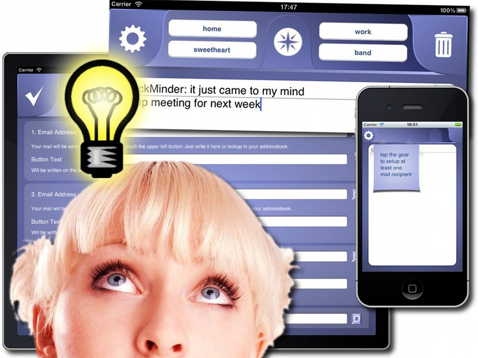

#  Quickminder (updated) #

*This software was sold in the Apple Appstore but is not [available](./20120922--1.md) anymore*

A thought, an idea, something you need to do crossed your mind: capture it quick, easy and fast with QuickMinder. Predefine up to four recipients for your thoughts and send them via email. It takes just two steps: Type your text in QuickMinder, push the button with your predefined recipient and the email will be sent. Set up once and you are good to go.

Features:

- universal app, runs on iPhone, iPod touch and iPad
- iPad: up to four recipients for your emails
- iPhone/iPod touch: up to two recipients for your emails
- look recipients in your address book
- uses the first line of text as a subject
- use a predefined subject
- turn off word correction if you like
- delete text automatically after you have sent your message if you like
- show keyboard directly after start, be quicker with writing
- runs in portrait and landscape mode
- sends mail using your mail account, mails come from you, no extra service needed
- insert current GPS coordinates if you like
- supports Retina Display
- supports creating and attaching photos
- supports TextExpander Touch

