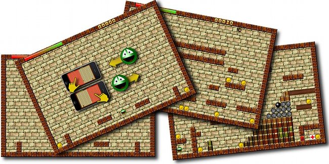

# JumpyRally (updated) #

*This software was sold in the Apple Appstore but is not [available](./20120922--1.md) anymore*

JumpyRally is a retro style jump'no'run. You read that right! So take the challenge and help Jumpy to jump around, collect and rally all gold coins. But beware of those villains, they will exhaust your energy!

Jumpy is quite old, you know. Back in the year 1989 it began jumping around on the world famous Amiga. Now that name was blocked in the iTunes AppStore® so Jumpy got JumpyRally. This game is a little reminiscence of that golden homecomputer age. Programs were written in Assembler most of the time...
And why is Jumpy collecting all that gold?

Look at him: he's from outerspace. Guess what, he needs money to get back 

Simply touch the left half of the screen to move left and vice versa: touch the right half of the screen to move right. Jumpy lives up to his name: he jumps up and down, that's how you get him through the maze.

Have a [glimpse](./20120601--3.md) at the past.

