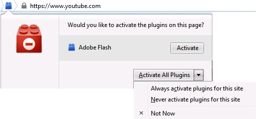

# Useless features, part 2 #

 A while ago I wrote about [useless features](./20120926--1.md). Mozilla put the great "click to play" function into Firefox but forgot to tell the users about it. This feature ~~is~~ was really cool. When loading a webpage all plugins weren't loaded, just a placeholder. Improved security (can you say Flash?) and speed. On the other hand the user could start a specific plugin on demand.

After the last update Firefox brings up a popup on every page that has plugins.

If you choose "not now", you will see this popup every time you visit the page again. Yeah, a built-in nag screen, come on Mozilla hurt me plenty.
If you choose "Never activate plugins for this site", you get what you want. Or not? Well, the site is loaded without any plugins, that's true. But what if I want to activate a specific one? No, no my friend, there is only all or nothing. If you want to change the setting, you must click on the blue brick that is shaped like a kids toy.

So there remains "Always activate plugins for this site". You want or must use a plugin for a site. Then you got no choice, you must activate it for the whole page. No more security, no more download speed.

And last but not least there are some sites with the old behavior, quite confusing.

Thank you Mozilla.

***NOT!***
