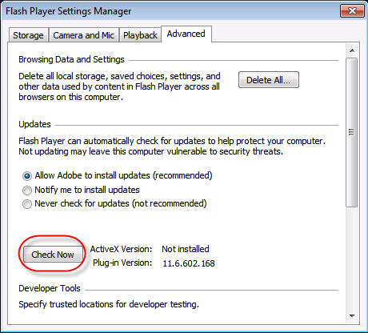

# Time to patch your Flash Player again #

Well, it's time to apply the latest patch to the Adobe Flash Player. Besides being a pain in the neck (because it happens so often - I wonder if the suicide rate of enterprise admins correlates with that), it's no problem on the Mac. Go to preferences, start the Adobe Flash Player preferences pane, click "Advanced", click "Check Now". A web service is called or just an URL is checked - I don't know and I don't want to know - and you get the message that a new update is available. Then you are asked if you want to download and apply it.

Easy as pie.

*Of course you can wait until the auto update mechanism tells you that there is an update.*

Now look at the control panel from Windows:

What would you expect to happen if you click on "Check Now"? Same as above? Don't be so naive.
A website opens and tells you the latest version for different operating systems. The rest is done with your bare hands, choose right version, download, start setup, yada yada yada.

***CRAZY***
