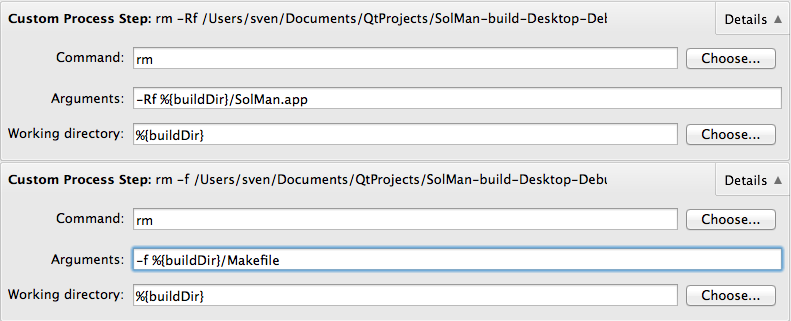

# Pimp the clean process in QtCreator #

Every now and then you clean your project. What bugged my for some time using QtCreator was that it left the *Makefile* and the `*.app` directory containing the (Mac) OSX App(lication).

No problem, just add a *Custom Process Step*.

