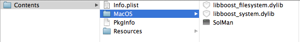

# Boost libraries on OSX - obstacles almost gone #

A few days ago [I wrote about first obstacles](./20130331--1.md) on using the Boost library in a Qt program. To be more specific, the dynamic libraries were not found from the executable. With a fairly crude hack I convinced the linker to just use the static ones. Problem solved.

*Not* really.

Basically it's "where to find the libraries?". If you just would place the compiled Boost libraries in the same directory as the executable it would work just fine.

Let's have a look at a binary, I chose SolMan here, my very first Qt project. It's kind of a code lab: a place to learn C++ and about the Qt framework. Never mind, we are talking libraries here:

```
sylimikro:~ sven$ otool -L SolMan.app/Contents/MacOS/SolMan
	/SolMan.app/Contents/MacOS/:
	/System/Library/Frameworks/ScriptingBridge.framework/Versions/A/ScriptingBridge (compatibility version 1.0.0, current version 1.0.0)
	/System/Library/Frameworks/AppKit.framework/Versions/C/AppKit (compatibility version 45.0.0, current version 1138.51.0)
	/Users/sven/devtools/taglib-bin/lib/libtag.1.dylib (compatibility version 1.0.0, current version 1.12.0)
	libboost_filesystem.dylib (compatibility version 0.0.0, current version 0.0.0)
	libboost_system.dylib (compatibility version 0.0.0, current version 0.0.0)
	QtGui.framework/Versions/4/QtGui (compatibility version 4.8.0, current version 4.8.4)
	QtCore.framework/Versions/4/QtCore (compatibility version 4.8.0, current version 4.8.4)
	/usr/lib/libstdc++.6.dylib (compatibility version 7.0.0, current version 52.0.0)
	/usr/lib/libgcc_s.1.dylib (compatibility version 1.0.0, current version 1094.0.0)
	/usr/lib/libSystem.B.dylib (compatibility version 1.0.0, current version 159.1.0)
	/System/Library/Frameworks/CoreFoundation.framework/Versions/A/CoreFoundation (compatibility version 150.0.0, current version 635.21.0)
	/System/Library/Frameworks/Foundation.framework/Versions/C/Foundation (compatibility version 300.0.0, current version 833.25.0)
	/usr/lib/libobjc.A.dylib (compatibility version 1.0.0, current version 228.0.0)
```

This tells us, that some libraries are looked for at well defined paths, e.g. `/usr/lib/libobjc.A.dylib`. This is no problem because that library is _just at exactly that place_ on any Mac system (Ok, let's say >= OSX 10.6, don't know older versions) out there. So looking out for the library in `/usr/lib/` will work just fine. But something like the Boost libraries is not on every Mac. Have a close look at those two lines here:

```
libboost_filesystem.dylib (compatibility version 0.0.0, current version 0.0.0)
libboost_system.dylib (compatibility version 0.0.0, current version 0.0.0)
```

There is not path in here.
No path could mean same path, let's try that one. Just copy the two library files to the same directory as the executable.



Start the program and - ah - it works. Ok, problem solved. _Again_.

*Nope*

Dynamic libraries simply don't belong there on a Mac, have a look at the [Apple - Bundle Programming Guide](http://developer.apple.com/library/mac/#documentation/CoreFoundation/Conceptual/CFBundles/Introduction/Introduction.html) or at [Qt - Deploying an Application on Mac OS X](http://qt-project.org/doc/qt-4.8/deployment-mac.html) if you prefer a more visual approach.

But if you just create that `Framworks` directory and put the library files there, your program can not start anymore. The libraries will not be found - _again_.

Ok, now we will try to change the information where the dynamic loader looks for the library.

```
install_name_tool -change "libboost_filesystem.dylib" "@executable_path/../Frameworks/libboost_filesystem.dylib"  SolMan.app/Contents/MacOS/SolMan
install_name_tool -change "libboost_system.dylib" "@executable_path/../Frameworks/libboost_system.dylib" SolMan.app/Contents/MacOS/SolMan
```

Interesting enough, starting the app now results in a new error message:

```
sylimikro:~ sven$ /Users/sven/Documents/QtProjects/SolMan-build-Desktop-Debug/SolMan.app/Contents/MacOS/SolMan ; exit;
dyld: Library not loaded: libboost_system.dylib
  Referenced from: /Users/sven/Documents/QtProjects/SolMan-build-Desktop-Debug/SolMan.app/Contents/MacOS/../Frameworks/libboost_filesystem.dylib
  Reason: image not found
Trace/BPT trap: 5
logout
[Process completed]
```


Hm...looks like he found the first library but can't find the second one that depends from the first. I guess you notice that I am trying a lot of things here with no fundamental knowledge of how it should be. That is exactly the problem: there are so many articles and blogs about the solution of this problem that are contradictory, exclude each other or just do not tell the whole truth. After I have discovered what seems to be the right way to handle this, I will try to find evidence that my conclusion is right.
Our binary would know where to look for the second dependent library. But it seems that the dynamic loader does his job recursively and the way from `libboost_filesystem.dylib` to `libboost_system.dylib` seems not to be clear.

Let's manipulate the entry in `libboost_filesystem.dylib`.

```
install_name_tool -change "libboost_system.dylib" "@executable_path/../Frameworks/libboost_system.dylib" SolMan.app/Contents/Frameworks/libboost_filesystem.dylib
```


Run the application...heureka!

Many blogs talked about changing even the name/path of the library itself. This seems to be obsolete. Nevertheless I am gonna try what happens if we also change this value:

```
install_name_tool  -id "@executable_path/../Frameworks/libboost_filesystem.dylib" SolMan.app/Contents/Frameworks/libboost_filesystem.dylib
```

Note that we must use another switch for the `install_name_tool` command. This is still working and more consistant in my eyes. Maybe we could even change the `ID` in the dependent library:

```
install_name_tool -id "@executable_path/../Frameworks/libboost_system.dylib" SolMan.app/Contents/Frameworks/libboost_system.dylib
```

Even that works. Is _this_ the right way to go? What is an `@rpath`? and what's the difference to `@executable_path`? [Apple can enlighten us here](https://developer.apple.com/library/mac/#documentation/DeveloperTools/Conceptual/DynamicLibraries/100-Articles/RunpathDependentLibraries.html#//apple_ref/doc/uid/TP40008306-SW1) :

> A run-path dependent library is a dependent library whose complete install name is not known when the library is created (see “How Dynamic Libraries Are Used”). Instead, the library specifies that the dynamic loader must resolve the library’s install name when it loads the executable that depends on the library.

That's not what we need, `@rpath` is out.

[This here is a good explanation](https://developer.apple.com/library/mac/documentation/DeveloperTools/Conceptual/DynamicLibraries/100-Articles/OverviewOfDynamicLibraries.html#//apple_ref/doc/uid/TP40002013-SW21) and a hint that I am not totally wrong.

*BUT*

Here they say

> Library-relative location. To specify a file path relative to the location of the library itself, place the @loader_path macro at the beginning of the pathname. Library-relative location allows you to locate library resources within a directory hierarchy regardless of where the main executable is located.

Oops. Next try...

```
install_name_tool -change "@executable_path/../Frameworks/libboost_system.dylib" "@loader_path/libboost_system.dylib" SolMan.app/Contents/Frameworks/libboost_filesystem.dylib
```

This works, too! And _this_ is _*finally*_ the most promising version of handling the paths of executable and it's dynamic libraries.

Now we know where the bits and pieces have to go. In one of the next blogs I will try to make this a more consistent and automated process.