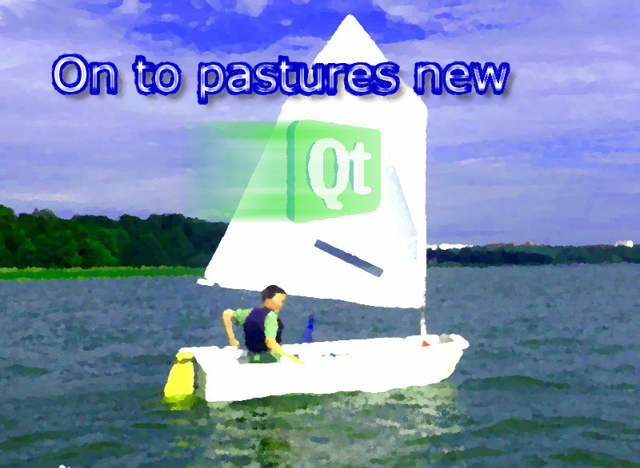

# Why I believe in Jolla #

It was last year during the summer holidays that I've read about Jolla. My girlfriend and I stayed in a mökki (=cottage) almost 40km away from Tampere - Finland. The only hi-tech gizmo we took to that place, was an iPad. Quite useful to checkout where the next stores are and it saves your holiday, because the iPad is a pure consumer product only: you are safe from doing anything productive (pun intended).

BTW: if you ever wondered how they calculate battery duration times for mobile phones, they test that in Finland -  wherever you go, you got prefect reception. OK, I am exaggerating here but compared to the mobile networks in Germany it is paradise. Watching Youtube videos in full scale the whole day here in Germany? Impossible!

And there was some news about some ex-Nokia employees that wanted to continue their vision of a Linux based and open phone/OS. I quickly read all that could be found in the internet those days - and that was not very much back then.

Just before the holidays I tested my two Applications in the Apple App Store with the beta version of iOS6 and well, knew that [this would become a road to nowhere pretty soon](./20120922--1.md).

I was very unhappy about the way a company like Apple communicates with customers and developers (if at all), that I was forced to pay money each and every year just to write and run some software on my own device. Don't get me wrong, there were positive trade offs here: I learned a lot about interface design that influences my work until now: even on Desktops your interfaces improve if you ever experienced the limitations of a pocket touch device.

Developing for Android phones could have been an alternative but I dislike the upgrade situation. You can't be sure to get the next version of the Android OS for your phone. And I am certainly not the guy that buys a new phone every year. _(Update: FirefoxOS is in my eyes a wrong approach. Why use a resource hungry browser for a low energy device?)_

So there they were: a pack of misfits that promised exactly what I wanted: a touch based phone with a free and open OS and a fluent UI. They came from Nokia and therefore had the knowledge to get the job done. The N9 was proof of that. Sadly the N9 was a dead product from day one, since Stephen Elop [burned the platform](http://www.mobile-ent.biz/news/read/nokia-ceo-stephen-elop-s-burning-platform-memo-leaks-in-full/013207).

The OS would have an UI based on [Qt](http://qt-project.org/) or [QML](http://qt-project.org/doc/qt-4.8/gettingstartedqml.html) to be more precise. I've had heard a lot about Qt but never used it before. Frustrated by the limitations of one manufacture/platform, it seemed reasonable to dig a bit deeper.

How hard would it be to learn C++ and make the first steps with the Qt framework?

I watched a lot of videos and tutorials during that holiday and after we came back I decided "on to pastures new".

From there on I soaked up every news about Jolla and started learning C++/Qt. The latter two turned out to be a bit harder than expected but that will be explained in another blog post sometime.

*Jump to may, 20th 2013 and beyond.*

Short after #JollaLoveDay some critical opinions came up, [one of them is here](http://jollatides.com/2013/05/22/pre-order-constructive-critique). First of all: that one was retweeted by Jolla, so no brushing under the carpet going on here. I give kudos to Jolla for that. Imagine something like that from the big players like Microsoft, Google or even Apple...

While I can understand the critics I am still convinced from Jolla. Today even more than ever before. I simply want to believe. Ok, that claim is already taken - Blackberry knew their X-files.

But why do I believe?

Because they believe in themselves! They seem like a bunch of underdogs and from the perspective of market share and financial success they certainly are. But I like underdogs and besides that they are not. Those are the same people that made up MeeGo (and all its other name iterations) and the N9 (yes, I repeat myself here). They convinced some venture capitalists and that alone is proof enough for me.

Of course there is still a risk. Isn't there always a risk in life? Wouldn't it be boring without? And if they succeed, not only will they have the success they deserve, no - I will get something, too:
the smartphone of my dreams.

Of course it would be nice to know more specs of the phone but on the other hand Jolla/Sailfish is not about specs. They made that very clear since day one. The competitors have stopped inventing new ideas and started the spec war some time ago. How do I benefit from 4 instead of 2 cores? Battery life goes down, thank you. SailfishOS is smooth on old hardware, no core porn needed here.
Yes, for some people a QWERTY would have been nice. But when did you ever think that this would be priority one for Jolla? They always showed pure touch devices and the majority of people seem to like that. Or why else are the touch devices more successful? And one thing is for sure: Jolla has only got one shot and that must be a strike. Not in the sense that they overtake the big players, no - it simply means they must be able to pay their bills and collect enough money to continue. Chances are much higher with a touch device.
And I also like to know some details about #theotherhalf. Who does not? Jolla would simply be mad to tell the world any details before they can ship. The rivals may not fear Jolla right now but they certainly have an eye on them: and be it just for getting new ideas. Jolla would be of the rocker! Why should they serve their ideas on a silver platter and risk that a copycat hits the market first? And maybe there will be #theotherhalf with a QUERTY as accessory one day.

Yes, I believe in them. And one way to show that is to [preorder](https://join.jolla.com/en) the device even without knowing any details. Whatever #theotherhalf will be, it will certainly be special. Let them just surprise me.

In the end I will pay the same price as anybody else, so no extra costs here for me. But a bit of support from me for Jolla to show them my love and believe.

So what's the risk? Jolla will declare bankruptcy before sending the device to me.
Well, then call me an (ad)venture-capitalist, too.

**I took the risk!**

