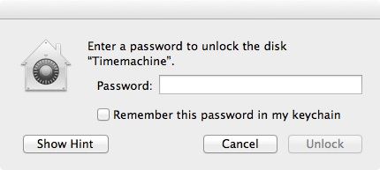
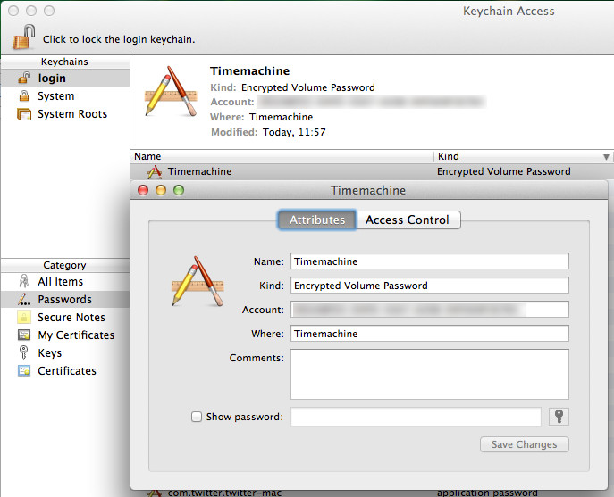
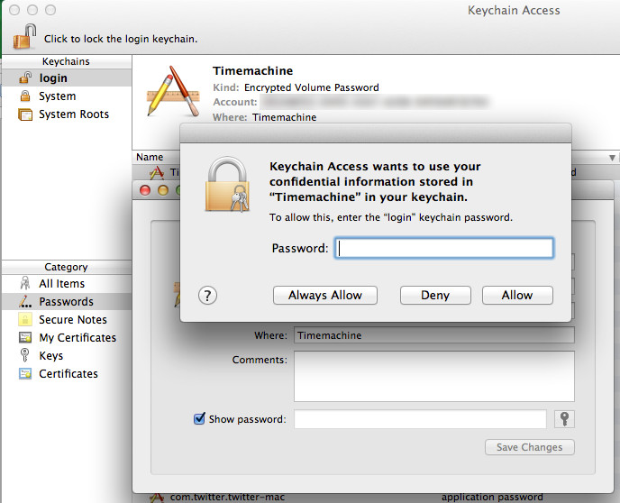

# 20130707  Timemachine and encrypted volumes - no paste possible - data save as in a vault

You use Time Machine, don't you? Was it ever easier to get an automatic backup that just works, once it is configured? And what is there to configure? That you want a) to use it and b) on which disk. Ok, you can choose some exceptions of directories/devices that should not be backup up, but that's pretty much it. Ah and there is this little checkbox that says _Encrypt backups_. Maybe you carry around your backup disk and just what to prevent a possible thief to read your data, maybe you are just paranoid.
Maybe I am both, I checked this little box and entered a password.

Fire and forget. _Ok, it took quite some time to encrypt the whole disk_

Until...


... I attached the backupdisk to my computer again and this little dialog popped up (I first had a typo and the dialog pooped up, haha):



Funny - why didn't this damn machine remember the password?. There is even a checkbox that says _remember in keychain_. No problem sir, just start my password tool, copy the password and paste it in.

*beeeeeep*

_Not!_

You just can't paste into that textbox (OSX Mountain Lion it is, I don't have other versions at hand). That would not be much of a problem if I didn't decide to use a 64 character long password, chosen by my password tool. _To make that clear: the dialog where I entered the password for the first time was able to accept a pasted password_ . So much for the paranoia part. The _Disk Utility_ didn't help neither. There came the same popup.

Well, thanks but no thanks. Is all (pretty damn safe) data lost now?  I could simply start from scratch, but I would loose my backup history.

But there comes help from the command line. Start up your terminal and look for your volume ID:

```
$ diskutil corestorage list
CoreStorage logical volume groups (2 found)
|
+-- Logical Volume Group FEDCBE98-EEEE-BBBB-DDDD-1234567890AB
|   =========================================================
|   Name:         Macintosh HD
|   Status:       Online
|   Size:         319213174784 B (319.2 GB)
|   Free Space:   0 B (0 B)
|   |
|   +-< Physical Volume 00000000-EEEE-BBBB-DDDD-222222222222
|   |   ----------------------------------------------------
|   |   Index:    0
|   |   Disk:     disk0s2
|   |   Status:   Online
|   |   Size:     319213174784 B (319.2 GB)
|   |
|   +-> Logical Volume Family 11111111-AAAA-BBBB-EEEE-333333333333
|       ----------------------------------------------------------
|       Encryption Status:       Unlocked
|       Encryption Type:         AES-XTS
|       Conversion Status:       Complete
|       Conversion Direction:    -none-
|       Has Encrypted Extents:   Yes
|       Fully Secure:            Yes
|       Passphrase Required:     Yes
|       |
|       +-> Logical Volume 33333333-AAAA-BBBB-FFFF-444444444444
|           ---------------------------------------------------
|           Disk:               disk1
|           Status:             Online
|           Size (Total):       318894403584 B (318.9 GB)
|           Size (Converted):   -none-
|           Revertible:         Yes (unlock and decryption required)
|           LV Name:            Macintosh HD
|           Volume Name:        Macintosh HD
|           Content Hint:       Apple_HFS
|
+-- Logical Volume Group 44444444-FFFF-BBBB-EEEE-555555555555
    =========================================================
    Name:         Timemachine
    Status:       Online
    Size:         499061317632 B (499.1 GB)
    Free Space:   16777216 B (16.8 MB)
    |
    +-< Physical Volume 55555555-EEEE-CCCC-DDDD-666666666666
    |   ----------------------------------------------------
    |   Index:    0
    |   Disk:     disk2s2
    |   Status:   Online
    |   Size:     499061317632 B (499.1 GB)
    |
    +-> Logical Volume Family 66666666-EEEE-CCCC-DDDD-777777777777
        ----------------------------------------------------------
        Encryption Status:       Locked
        Encryption Type:         AES-XTS
        Conversion Status:       Complete
        Conversion Direction:    -none-
        Has Encrypted Extents:   Yes
        Fully Secure:            Yes
        Passphrase Required:     Yes
        |
        +-> Logical Volume 12345678-AAAA-BBBB-CCCC-00DEADBEEF11
            ---------------------------------------------------
            Disk:               -none-
            Status:             Locked
            Size (Total):       498725769216 B (498.7 GB)
            Size (Converted):   -none-
            Revertible:         Yes (unlock and decryption required)
            LV Name:            Timemachine
            Content Hint:       Apple_HFS
```

There it is, a logical volume with the name _Timemachine_ and much more important, its ID:
_12345678-AAAA-BBBB-CCCC-00DEADBEEF11_.
We need that to unlock the volume:

```
$ diskutil corestorage unlockVolume 12345678-AAAA-BBBB-CCCC-00DEADBEEF11 -stdinpassphrase
Passphrase:
Started CoreStorage operation
Logical Volume successfully unlocked
Logical Volume successfully attached as disk3
Logical Volume successfully mounted as /Volumes/Timemachine
Core Storage disk: disk3
Finished CoreStorage operation
```

Just _paste_ your password into the terminal when you are asked _Passphrase:_
The disk is beeing mounted and can be used for backups again. But I don't want to use the terminal every time from now on. So we simply change the long and complicated password to a intermediate short one:

```
$ diskutil corestorage changeVolumePassphrase 12345678-AAAA-BBBB-CCCC-00DEADBEEF11 -stdinpassphrase
Old passphrase:
New passphrase:
Started CoreStorage operation
Logical Volume passphrase has been changed
Core Storage LV UUID: 12345678-AAAA-BBBB-CCCC-00DEADBEEF11
Finished CoreStorage operation
```

Again, paste in your (complicated) password when asked _Old passphrase:_
Enter a new and easy to remember password when asked _New passphrase:_
Unmount the disk, stick it back in and enter the new password. Don't forget to check the _Remember password_ checkbox.
Try it. You can unmount it, put it back and now everything works automatically.

Inside your _Keychain_ utility you can see a new entry.



The _Account_ data seems familiar: it is the ID of the _Timemachine_ volume.
Now we can change back the password of the device, just enter your new complex password again:

```
$ diskutil corestorage changeVolumePassphrase 12345678-AAAA-BBBB-CCCC-00DEADBEEF11 -stdinpassphrase
Old passphrase:
New passphrase:
Started CoreStorage operation
Logical Volume passphrase has been changed
Core Storage LV UUID: 12345678-AAAA-BBBB-CCCC-00DEADBEEF11
Finished CoreStorage operation
```

Now the other way around, enter the easy to remember password on _Old passphrase:_ and the complicated should be pasted in on _New passphrase:_
And change it in the keychain also. Just click on _Show password_ and enter the password of your current account in the now showing password dialog. The _intermediate_ password should show up for your _Timemachine_. Fill in the new (or old one from another perspective) one and _Save Changes_.



Now your disk and the entry in your _keychain_ have both the correct password. Check it out, it _just works_ ;-)