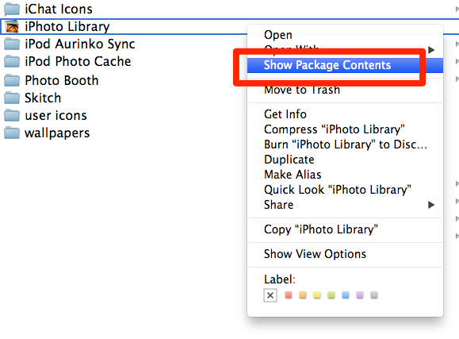
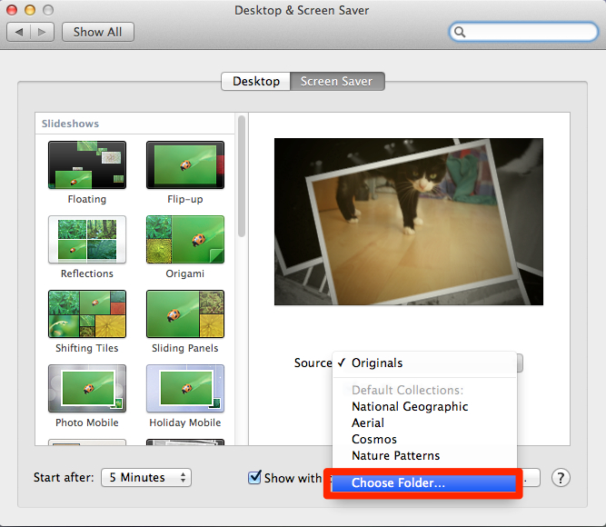

# OSX Mountain Lion - screensaver can not show your iPhoto library anymore #

My favorite screensaver on OSX Snow Leopard & Lion was the one that showed the iPhoto Library. This way you get a glimpse at memorable moments (again).
After migration to OSX Mountain Lion I noticed that the screensaver didn't show photos anymore - strange - but I didn't investigate then. Last weekend I entered the screensaver settings and was more than surprised that all those screensavers are not capable to show photos of my iPhoto library. Come on Apple, is that your implementation of _it simply works_?

After visiting Mr. Google it was clear: I am using an older version of iPhoto (yes, the one that came with Snow Leopard, the one I've already paid for), after an update via Appstore this would work again. Well, hello? What kind of mindfuck is that? iPhoto still works on OSX Mountain Lion, there is obviously no technical reason here.

It's politics and

money making.

As simple as that.

Albeit I like the physical touch and feel of Apple devices, I surely don't like their way of customer experience and paternalism.
As a customer I would expect that an OS update also updates the applications that came with the updated OS.
I don't know how much I can cope with that kind of bullshit but I sense the final straw is near. The next computer must not be an Apple device!

Ok, so much for ranting, here is a little workaround. It's not perfect, because it doesn't show the images that were manually rotated. But hey, some is better than nothing.
The iPhoto library is no single file, it's a folder - just presented as single file (as in "the regular user does not have to care what's inside") by the Finder. if you choose _Show package content_ from the context menu, you can look inside.



And since it's a folder, we can create a link to a folder inside of it.
Open your terminal and enter

```
$ ln -s /Users/YOURUSERNAME/Pictures/iPhoto\ Library/Originals/ /Users/YOURUSERNAME/Pictures/LinkToPhotoLibrary
```

Go to your screensaver preferences, choose one of those that can show images. Click on _Choose Folder_ from the dropdown box and choose <code>/Users/YOURUSERNAME/Pictures/LinkToPhotoLibrary</code> as directory.



Voilá, there are some photos :-)
