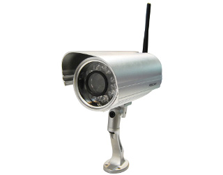
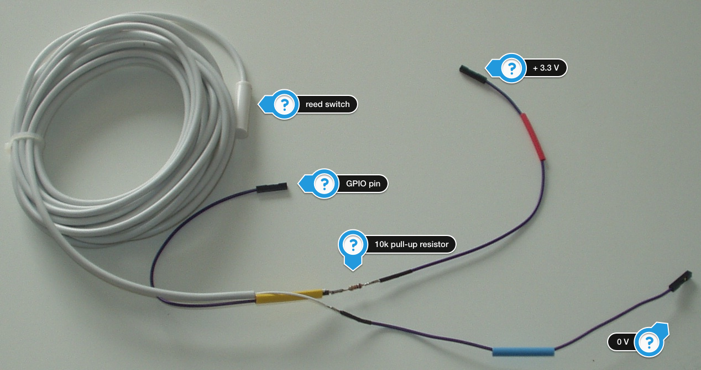
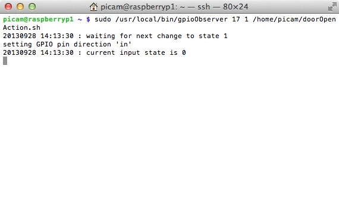

# Poor man's surveillance system with Raspberry Pi #

A few days ago I've bought an IP camera from Foscam.



The result was very disappointing. Besides the fact that this thing was D.O.A. (it lost its network connection every 10-15 seconds and never transferred one single image), the web interface was for lack of a better word: _bullshit_. That thing went straight back and they didn't convince me to order another one. Even the max. resolution of the camera was not as advertised.

So I wanted an IP camera, a Raspberry PI was already at home. It could simply be extended to use wireless LAN and there is a camera module available.
*ding* *ding* *ding*
It's project time :-)

Instead of a infrared motion sensor or even a fancy _is there a movement in the picture_ algorithm I decided to go vintage. Using a reed switch it is quite easy to check if a door or window has been opened. The Raspberry Pi has a [GPIO interface](http://elinux.org/RPi_Low-level_peripherals), connecting an external switch to the little computer is almost foolproof.
You just need a pull-up resistor and you are ready to go.




That's for the switch part.

For wireless connection I've [attached a Logilink WL0145](http://www.gtkdb.de/index_36_2121.html) (sorry, it's in German). Worked like a charm at first sight but the adapter lost connection after one day. There seems to be a problem with the power management, so it's simply siwtched off (runf `iwconfig` to see if it's _on_), edit `/etc/network/interfaces` and put a line with `wireless-power off` in there.

Maybe that's not enough, future will tell. But there is [help out there](https://github.com/mharizanov/WiFi_Check/blob/master/WiFi_Check).

Almost a year ago I started learning C++, so it became clear that a tiny bit of the software side would be coded in C++. The first examples I found showed some kind of bash command that read in the status of a GPIO pin and then slept for some time and that in an endless loop. This would be the first time that I would write code in C++ for Linux, so the Qt framework comes into mind to even out the platform specific details. Not knowing the exact implementation details of a QTimer, I sensed that it would be a tiny bit more elegant to use a timer that calls a function, which pulls the status of the GPIO pin. There is even a Debian Wheezy based kernel out there that would enable the use of interrupts but I couldn't find any examples, details, whatsoever.

The first kind of library to access those pins from C++ that I found was [http://hertaville.com/2012/11/18/introduction-to-accessing-the-raspberry-pis-gpio-in-c/](http://hertaville.com/2012/11/18/introduction-to-accessing-the-raspberry-pis-gpio-in-c/). So I used it.

The outcome is [gpioObserver](https://github.com/hardcodes/gpioObserver.git)

When started on the command line it waits for a given GPIO pin to change its status to the desired one and then call an external program, e.g. [raspivid](http://www.raspberrypi.org/camera).

For reading the status of a GPIO pin you must be `root`, `sudo` as user `pi` or edit `/etc/sudoers` with `visudo` in such a way that you can `sudo gpioOberserver` from a regular Linux user.

To get started, install the [Qt environment on your Debian Wheezy Image](http://qt-project.org/wiki/apt-get_Qt4_on_the_Raspberry_Pi), download the code from [Github](https://github.com/hardcodes/gpioObserver.git) and compile.

```
$ git clone https://github.com/hardcodes/gpioObserver.git
```

Compile with

```
$ qmake
$ make
$ sudo make install
```

The executable will be installed as `/user/local/bin/gpioObserver`. You can `sudo` it as user `pi` or add a new user and work on `/etc/sudoers` if you want that task separated.

`gpioObserver` waits for a signal change from `0` to `1` and then starts a ~~[batch script](https://github.com/hardcodes/doorAction.sh.git)~~ that mounts a drive on a NAS system, records a videofile with `raspivid` and unmounts the drive again. Start `gpioObserver` from `crontab`, e.g. like

```@reboot /bin/sudo /usr/local/bin/gpioObserver 17 1 /home/picam/doorAction.sh >> /home/picam/log/doorAction.log 2>&1```



*TADA* - your poor man's surveillance system with Raspberry Pi


**Update**

Today I would use Rust to write this little program.
