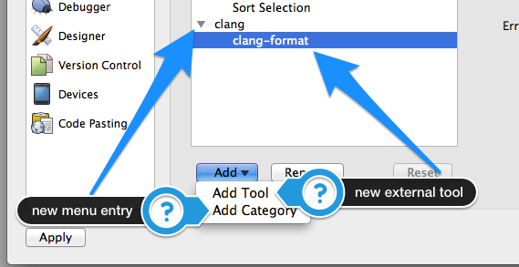
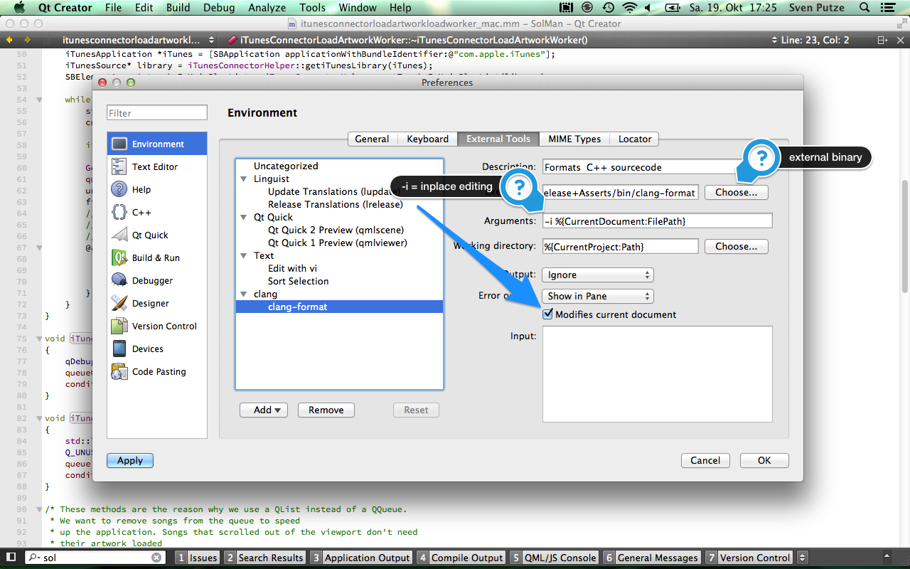
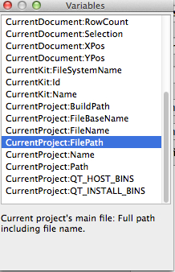
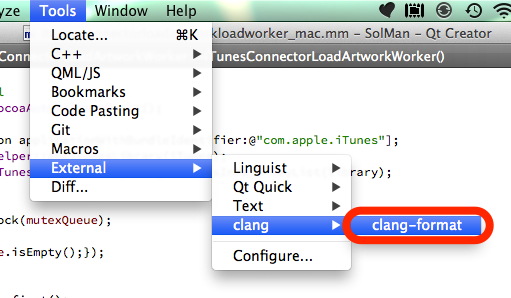

# Use clang-format with QtCreator #

Thanks to [Tobias Hunger](https://twitter.com/t_hunger) from [Digia](http://www.digia.com) I now learned how to extend QtCreator with external tools. Not that it's difficult but he had a talk about it at the Qt Developer Days 2013 in Berlin and showed that it's very easy and powerful.

As I saw [Chandler Carruth talking](http://channel9.msdn.com/Events/GoingNative/2013/The-Care-and-Feeding-of-C-s-Dragons) about clang and its tools at _Going Native 2013_ (just on video, no need to get jealous here), I was instantly hooked, [built the tools](./20131019--1.md) and now want to use them inside QtCreator.

Open the preferences and add a new category if you like. This appears as a new menu entry inside the Tools/External menu.

Add a new tool, look up the binary (or script) and add its arguments

QtCreator has some variables that you can use to specify the source code file that should be processed by the external tool.

Here is one tiny example of what <code>clang-format</code> does for your code. Choose _clang-format_ from the _tools_ menu and

this code...

...turns into...

But be careful: currently QtCreator does not enable _undo_ for such an action. Of course your source code control system fills up that gap.