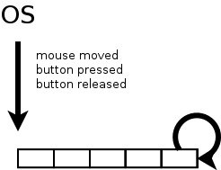
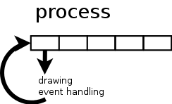
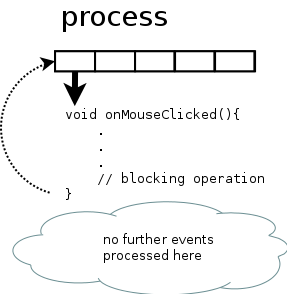

# Pump up the message - blocked from the promised future #

Every window system I know of, uses an implementation of an _event loop_ to process things like mouse button clicks and alike. Maybe in your window system it's not called _event loop_, maybe the term _message dispatcher_, _message loop_ or _message pump_ is used. The basic idea behind this should be the same: the operating system handles things like mouse movements, interrupts and puts them into a central queue.



A dispatcher pulls event after event from this queue and decides which process should handle it. In case of interrupts you may have registered to be informed when it happens. When the user presses the mouse button, the dispatcher can calculate which window is affected and hand control over to the corresponding process.



As long as the process handles this event, no GUI drawing happens, no further events are taken from the queue by the dispatcher or if dispatched are queued on process level, they are not further processed there.




## The problem

On one hand that means that you as a coder have to return control to the dispatcher as fast as possible and on the other hand every kind of long processing has to be handled concurrently, e.g. in another thread. This peculiarity is shared by many operating systems and programming languages. It does not matter if it's Linux, OSX or Windows (or something else) and it happens regardless of the language used. Be it C, C++, C#, Java and whatnot. This blog entry is about what that means for C++ programs compared to the solutions in other paradigms.


## The solution

Instead of putting the blocking operations into the event handler, shovel it into a separate function and call it in another thread. Your event handler can return immediately, events will still be processed and the GUI can be drawn.
And they live happily ever after, don't they?


## More problems

Depending on programming language and operating system, creating a new thread can be just a few lines of code or royal PITA (I am looking at you, Qt framework), consisting of tons of boiler plate code. When the thread is finished, it must somehow inform your main program about it. If the user pressed a button and started whatever action, he should be notified that something has happened. Some thread implementations are not designed to do that, they are more like hit and run. Not so useful in UI programming.

Let's assume starting a new thread is as easy as pie and your are informed that the thread has ended, the handling usually happens in some sort of _callback function_ (or _slot_ or _delegate_ or…), or in other words: it happens somewhere else. Maybe you are even still in the context of the separate thread and can not draw to the GUI.

If you are using C#/.NET, you get help from the [BackGroundWorker class](http://msdn.microsoft.com/de-de/library/system.componentmodel.backgroundworker(v=vs.110).aspx") that abstracts the thread handling, there are also some lines of code to write but they are handled by the IDE mostly. You as the coder can focus on the task itself.

If you want something like that in C++, you must write it on your own. Even in GUI frameworks like Qt, which set out to ease the pain of writing UIs in C++, there is nothing comparable. Yes, it's doable, but stupid boiler plate repetitive work. _For the ones that didn't get it so far: I'm in a love/hate relationship with the Qt framework._ I don't even want to talk about writing native (cough, MFC, cough) code for Windows. That's just ridiculous and clearly not the foundation for the success of that platform.

On top of that most UIs don't just have only one button, your code base grows, the code flow is interrupted and bit by bit it transforms to spaghetti code.


A maintenance nightmare.


## Cut down to the chase

Long story short: 

* your code must return fast from an event handler
* you probably want to write stuff like _first do task A asynchronous and task B afterwards_


## A better solution


### C#

Let's have a closer look how it's done in C# nowadays:

```csharp
async Task<int> GetAnswerToTheUltimateQuestionOfLifeTheUniverseAndEverything()
{ 
    HttpClient client = new HttpClient();
    // GetStringAsync returns a Task<string>. That means that when you await the 
    // task you'll get a string (urlContents).
    Task<string> getStringTask = client.GetStringAsync("http://blog.hardcodes.de");
    // work here that doesn't rely on the string from GetStringAsync.
    InitDeepThought();
    //  - The await operator suspends GetAnswerToTheUltimateQuestionOfLifeTheUniverseAndEverything. 
    //  - GetAnswerToTheUltimateQuestionOfLifeTheUniverseAndEverything can't continue until getStringTask is complete. 
    //  - Meanwhile, control returns to the caller of GetAnswerToTheUltimateQuestionOfLifeTheUniverseAndEverything. 
    //  - Control resumes here when getStringTask is complete.  
    //  - The await operator then retrieves the string result from getStringTask. 
    string urlContents = await getStringTask;
    // ignore string and return the only true answer anyway
    return 42;
}
```

Isn't that cool? Spin off concurrent execution simply by calling an async function and then continue on the task object when it's ready! The given example was not GUI based but that's exactly the kind of pattern we need.


### Objective-C

```objc
- (void)viewWillAppear:(BOOL)animated
{
    dispatch_queue_t downloadQueue = dispatch_queue_create(“image downloader”, NULL);
    dispatch_async(downloadQueue, ^{
         NSData *imageData = [NSData dataWithContentsOfURL:networkURL];
         dispatch_async(dispatch_get_main_queue(), ^{
             UIImage *image = [UIImage imageWithData:imageData];
             self.imageView.image = image;
             self.imageView.frame = CGRectMake(0, 0, image.size.width, image.size.height);
             self.scrollView.contentSize = image.size;
         });
    });
    dispatch_release(downloadQueue);
}
```

*Example taken from [iPad and iPhone Application Development by Paul Hegarty](https://itunes.apple.com/itunes-u/ipad-iphone-application-development/id473757255?mt=10)*

Before we dive into this example, just a few words to those not familiar with Objective-C: code starting with a caret sign ( as in `^{ //some code here }`) is called a _Block_. This is simply a Lambda function. The `dispatch_…` code parts call a C API from a library named _Grand Central Dispatch_. It is used to put _Blocks_ of code in queues that are executed in separate threads. Very similar
 to the event queueing of the operating system, instead of events some pieces of code are queued. Remember the _GCD_ name, we will come back to that later on.

The above mentioned example downloads an image from a network URL in a separate thread and when that is done, it puts the image somewhere in the UI. The UI can only be manipulated from the main thread, so this _Block_ of code is queued on the main thread.

By far not as elegant as the C# solution but still a pretty lean way to keep the corresponding pieces of code together. Everything is written in the same function but executed at different times in another context. The burden of multithreading is lifted and abstracted away.


### C++,  a better solution lies in the future

With C++11 came a nice feature called _future_ which provides a mechanism to access the result of asynchronous operations. Those asynchronous operations can be started with _async_.

```cpp
// std::async returns a future, looks like a C# task object at first glance
auto f = std::async(
    [](){
        return 42;
    });
...// do something completely different and finally
   // fetch the result
int answer = f.get();
```

The caveat here is that calling `get()` on the _future_ blocks. While there are scenarios where this kind of behavior s useful, for firing up your UI it is _not_. IMHO that is humiliating in the year 2014, but who am I to criticize the C++ language?


## Solutions that work now already


### Microsoft

Microsoft has created the [PPL](http://msdn.microsoft.com/en-us/library/dd492418.aspx), a library that can amongst other tasks be used to execute work items in parallel. If you are in WinRT programming, you will certainly stumble upon this because there you will use the concept of continuations for executing stuff async and keeping the UI fluent.

On [Code Project](http://www.codeproject.com/Articles/585998/Csharp-style-async-await-in-Cpl) is a nice article about using the open source versions of this library. I have not tried that personally (yet) but maybe this is a nice way of using this with another OS.


### Qt

At the QtDevDays2013 [Ivan Čukić](http://ivan.fomentgroup.org/) held a nice talk about "Natural task scheduling using futures and continuations". Using QFutures and some clever template meta programming he introduced an example of writing readable code. If you use the Qt framework, you should give it a try!


### Apple

Make sure that you watch [Sean Parent's talk](:http://channel9.msdn.com/Events/GoingNative/2013/Cpp-Seasoning) from GoingNative2013. Among a lot of useful insight in coding he mentions  [libdispatch](https://libdispatch.macosforge.org), published from Apple open source. Out of fairness - and before I begin to write what fascinated me - I must mention that I first was linked to the talk in this [tweet](https://twitter.com/meetingcpp/status/376372602089897985) from _Meeting C++_. The part I am referring to would also [match here](http://meetingcpp.com/index.php/br/items/resumable-functions-async-and-await.html). Remember the _Grand Central Dispatch_ library in the Objective-C example? The library is open source, too!
And Sean parent uses that one to create an even more convenient way to use the power of the library, since he [posted the slides](https://github.com/sean-parent/sean-parent.github.com/wiki/Papers-and-Presentations) in public, I think it's OK to quote his example code here:


```cpp
namespace adobe {
template <typename F, typename ...Args>
auto async(F&& f, Args&&... args)
-> std::future<typename std::result_of<F (Args...)>::type>
{
    using result_type = typename std::result_of<F (Args...)>::type;
    using packaged_type = std::packaged_task<result_type ()>;
    auto p = new packaged_type(std::forward<F>(f), std::forward<Args>(args)...);
    auto result = p->get_future();
    dispatch_async_f(dispatch_get_global_queue(DISPATCH_QUEUE_PRIORITY_DEFAULT, 0),
    p, [](void* f_) {
        packaged_type* f = static_cast<packaged_type*>(f_);
        (*f)();
        delete f;
    });
return result;
}
} // namespace adobe
```

Seems worth looking at, doesn't it?
So there are some alternatives to circumvent the blocking `future.get()` but as nice as they are - they are not standardized. And being in the standard is IMHO needed to get programmers to use such features in their code.

Hopefully the [Parallelism and / or Concurrency TS](https://isocpp.org/std/status) get us going this year.
