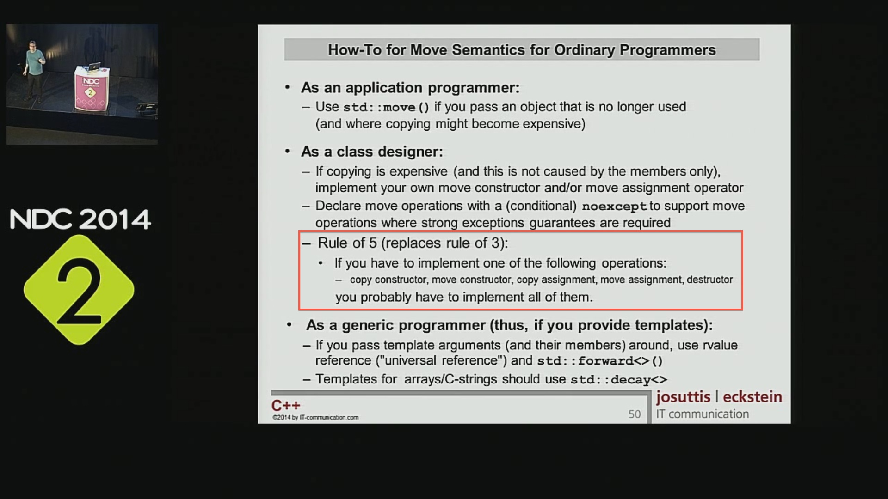

# 0,3 or 5 - make it your rule #

While reading _Effective C++_ from Scott Meyers I came accross item 5 where he refers to constructors and operators that are automatically created for you by the compiler as long as you don't provide an implementation of your own. While C++ waded through the nebula of 98 those were

* destructor
* copy constructor
* copy assignment operator

I've heard that before but it's always good to recap those topics and have a look at them from another perspective. Hand-in-hand with those functions comes the famous [rule of three](http://en.wikipedia.org/wiki/Rule_of_three_%28C%2B%2B_programming%29). If you decide to implement - for what ever reason - one of those constructors or operator, then implement all three of them.

In the modern age we have C++11 and with it came the

* move constructor and
* move assignment operator.

Are those created by the compiler, too? This question is so simple, I almost don't dare to ask. But are they? One could assume that they are - it would make sense. But have you ever read about that while there was the buzz about C++11? I've heard a lot about _move constructors_, _lvalue and rvalue references_ the latter under reasonable suspicion to be [universal references](http://isocpp.org/blog/2012/11/universal-references-in-c11-scott-meyers), but no one - at least to my knowledge - talked about the default behavior if you don't write your own versions of those move thingies.

_Google it!_ could be your answer and you are probably right with that. Chances are high that I would land somewhere on Stack Exchange and get a correct answer.

But were would be the fun if there is a [standard](https://isocpp.org/files/papers/N3797.pdf) out there, where we can read on our own? I am cheating on you right now, because N3797 is the draft for the next standard, but hey - this is 2014 and besides that I don't expect groundbreaking changes in that area between C++11 and C++14.

> 12 The default constructor (12.1), copy constructor and copy assignment operator (12.8), move constructor and move assignment operator (12.8), and destructor (12.4) are special member functions. [ Note: The implementation will implicitly declare these member functions for some class types when the program does not explicitly declare them. The implementation will implicitly define them if they are odr-used (3.2). See 12.1, 12.4 and 12.8. —end note ]

OK, the _implementation will implicitly declare these member functions_ under some conditions. That is good! There are some internet sites out there where you can read that they are _not_ created by the compiler (no links provided here for a good reason). Bafflement, be my guest.

If your class is somehow special (regarding memory management) in such a way you believe  that you can do better than the compiler, go ahead and define those special member functions. But make it *5* and not _3_! The reasons remain the same, the number of special member functions simply has grown. However, there are [people](http://www.ifs.hsr.ch/Peter-Sommerlad.5826.0.html) out there that advocate for the rule of *0*. Zero as in _never define your own special member functions_. Too 	fundamentalist for you? Maybe just keep it in mind and think about the next time you want to write your own.

## Update 20140918

After watching [Nico Josuttis' talk from NDC 2014](http://vimeo.com/channels/ndc2014/97337253) I've learned one more rule:

_If one=default, define all special member functions_

With C++11 came the new keyword `default`, which tells the compiler to explicitly use the default version of this special member function. If you declare, e.g. `virtual ~MyClass() = default;` in a base class, you disable default move semantics implicitly.
So if you define one as `default`, you should define all. Those can be `default` versions also.

Summarized in the following screenshot (with other useful rules and hints):

