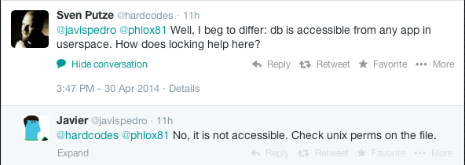
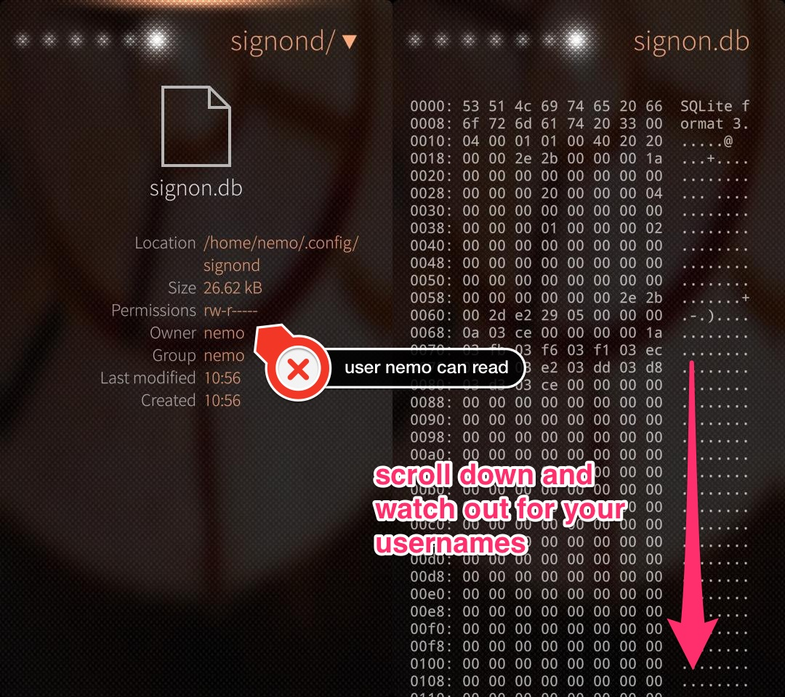

# Secure passwords on SailfishOS? Grandfather, tell me a story! #

Maybe you have heard about the [Jolla](http://www.jolla.com) phone, maybe you even own one of those devices. I was a strong believer in the idea of the phone and the people behind it. But as so often, if you scratch off the paint you can see the grotesque truth.

On their community page I found this [alarming thread](https://together.jolla.com/question/39495/security-risk-with-sqlite-db-in-jolla-passwords-in-plain-text-in-user-space/), but maybe better take a seat before you read that.

I've started a ~~[Twitter conversation](https://twitter.com/hardcodes/status/461637954373697538)~~ about that topic and in the old good cooperate tradition of ostrich-like policy the reaction from Jolla was 0 as in zero.



As you can see there are also people out there that refuse to see the truth, a kind of religious dazzlement I so far only suspected in the church of Cupertino.

Don't believe me?
Great!
Go and look for yourself, download the _File browser_ app from the Jolla store, set the option _show hidden files_ and open the database.



Voilá, there are your usernames in plaintext in user space, readable for every app on your Jolla phone! Guess what, the same can be done with the file _signon-secrets.db_ which contains your passwords in plaintext.

Getting your usernames is a simple as executing

```sql
-- do that on signon.db
SELECT id, username
FROM [CREDENTIALS]
WHERE username <> '';
```

and the passwords are extracted with

```sql
-- do that on signon-secrets.db
SELECT id, password
FROM [CREDENTIALS];
```

using any tool that can handle SQLite databases.

_The internet is a bad place per se_ I hear you mumble. Yes, that is for sure but do I need to present my passwords to the world in a fishbowl? _To the world? What is he talking about?_ Well, every app does include your browser on the phone. Yeah, just raise your eyebrows in disbelief for some moments and afterwards imagine someone creating a link like [file://./home/nemo/.config/signond/signon.db](file://./home/nemo/.config/signond/signon.db) for use with the SailfishOS browser (open in a new tab and your browser will download that file!). Just imagine a security breach in the Javascript sandbox...
This was just a silly demonstration but some rogue app could do that way more sophisticated behind your back, transfer your accounts and passwords without leaving any trace and without a chance for you to take note. Does the average Joe use the same email address and password for Amazon, Paypal and whatnot? Yes, (s)he does! 

It doesn't matter in what kind of file the credentials are stored (textfile, database, other kind of binary blobs), make sure that this file is not readable for each and every app and encrypt all data! While you're at it, do not store the key in a file next to the credentials. This would be as safe as the key to your home under the mat.

Somehow this is a hen and egg problem as there must always be a way to open the lock and look at the data (=decrypt for usage). The comfort of just storing hashes does not apply here, you need a two way encryption. The key should contain something unique to the device (and not accessible by unprivileged processes) and something only known to the user (e.g. like a hash derived from the lock pin), so that it's extremely hard to decrypt if the file is separated from the device (=stolen).

Jolla, what ever you do, just do not use plaintext!

## Update 20140502

Let me rephrase the last sentence:
Jolla, please fix those file permissions ASAP! Then bring us a keyring feature!

## Update 20140614

With the update to firmware 1.0.6.17 they changed the owner of the folder `signond` to `privileged.privileged` and scrambled the passwords in the file `signon-secrets.db`. Took some time but they finally did something.
Still missing a keychain though...
