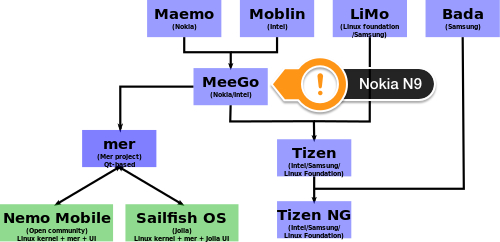

# The art of raising expectations and to fail on them #

For some weeks now I've been struggling with strong feeling about the Jolla phone. Dark feelings to be more precise. I was - no I am - disappointed, unhappy and to some extend even angry. If I wouldn't have dropped the phone on the floor and so scratching its surface with my own clumsy fingers, I would have gone so far as to send this phone back, because in my eyes it is somewhere between defunct and a toy. An expensive defunct toy so to speak.

Wow, that's some pretty shade of dark, isn't it?

# tl;dr

This isn't the first product in the world that doesn't do what's advertised or what I hoped for it would do, so I kept on wondering for a while, _why_ it happens to cause so *strong* feelings _this_ time. In the end we are talking about a machine, a dead thing, right?

While the whole story began for me in the [year 2012](./20120817--1.md), I've preordered a Jolla phone in [may 2013](./20130527--1.md), because I was caught in the net of clever public relations casted by Jolla over some period of time. Here are some keywords that have triggered something inside of me:

* humble
* open
* free
* open source
* unlike

Combined with the image of some underdogs that convinced me to join the fleet. That's what advertising and public relations is about: create (positive) emotions. And those were the words that created emotions inside of me at that point in time. With those emotions came associations and interpretations that grew up very fast to a big pile of expectations.
While the guys and gals behind Jolla were (and maybe still are) underdogs in the _Game Of Phones_, they came with some pretty nice legacy on board: at least a few employees were exiled Nokia staff. The same people that brought life to the Nokia N9. I personally never had a N9 because it was a dead product here in Germany from day one on. A sad business decision made by Nokia back then. No, I'm not gonna dwell in agony about what happened to and with Nokia. That's history. The point I'm trying to make is: if this phone is made by the same people that made the N9, I will get something that is at least as good as the N9 and since they are promising to be unlike, I will get a N9 + X. Whatever X would turn out to be, my expectation was to something more, some added extra value.

They promised to be open. That rang a bell inside of me, because some fruit company in Cupertino was [not](./20130327--1.md) and still is not. The openness I expected comes in several flavors, though. Open means, I can put self written software on that phone without extra costs and jumping through artificial hoops. Jolla met my anticipation in that point. Good! But there is more going on with being open. It means to open for feedback and criticism and doing what the users suggest. To a certain degree they are, have a look at [together.jolla.com](https://together.jolla.com/questions/). While that's a good example for having a platform where users can share their ideas, it's at the same time the evidence for things not happening: even the [simplest suggestions](https://together.jolla.com/question/12694/display-current-date-on-lock-screen-and-status-area/) do not become a manifest in features on my phone. Is it just the lack of man-power or are they not as open to ideas as they claim to be?

Jolla was so bold to create the impression not only they can build a phone, they would be _unlike_. Whatever that means, but my hope was to get at least something that I think of as an industry standard for a _smart_ phone: easy sync of contacts and calendars. Since we are _open_, this would pretty sure mean CalDAV and CardDAV. What else? Well, Jolla was _and still is_ so _free_ and _open_ as to not have those features on board (yet). Instead they came with more exotic variations of dialects that are only spoken by a few people in the world. 

How could I have missed that? Of course, Jolla is a Finnish company. Finnish is a language spoken only by a few people in the world. That was no imprudent choice, no - that was ancestry. The pun is intended here, by the way. But before you load your gun and shoot: I have some Finnish heritage for myself and so I am allowed to dump that kind of humor in the realms of the internet. At least I think I do.

*But Google is not just a few people! you say?* No, Google is huge! But just imagine, they [don't need](https://support.google.com/calendar/answer/99358?hl=en) their own protocol. *And Microsoft is a big player, too!* Year, that's also right. But who expected to get ActiveSync in the first place? I simply assumed that a _free_, _open_ minded _open source_ company would support a protocol that suited that image just fine. Why certainly there are many people using ActiveSync on this planet as they live inside a Microsoft ecosystem.

**Update 1.0.7.16** - CalDav finally works! However, only partially. If I add a generic CalDav Account, I get only the birthdays...

Are they the main target audience for the Jolla phone? Jolla as a business phone? Could a phone be less [MDM](http://en.wikipedia.org/wiki/Mobile_device_management) friendly?

Speaking of Microsoft, what mind came up with the idea of using [MTP](http://en.wikipedia.org/wiki/Media_Transfer_Protocol) for the USB connections? Come on, SailfishOS is a Linux based operating system!

Look at the picture above!

SailfishOS is a successor of Meego and it's [truly open](http://jolla.com), which I interpret(ed) as _open source_. Besides this tiny layer above Mer - that's not open source (unitl now). Hm…this tiny layer _is_ SailfishOS, isn't it? _Honi soit qui mal y pense_.

If it's not about the features what _is_ Jolla about?

### Is it about developer experience?

[I have my](https://lists.sailfishos.org/pipermail/devel/2014-February/003283.html) doubts. *That's not fair*, you claim? If you want to draw the attention of developers to an unimportant device (from the sales figures point of view), you need some incentive. That could be extraordinary good API with outstanding good documentation. All that gathered at one place and presented in a consistent way. I don't care from which open source project the bits and pieces come and came, I just don't want to play Sherlock Holmes. No spotter needed, it's all Qt. Is it? Until you must use the D-bus and have no clue of what is possible. Where is the complete list of RPC calls? What about QML plugins like a filedialog? What about all the other pieces Mer is build upon? What about the small amount of libraries allowed in the Jolla store?
Yes, you can have it that way, that's your own choice. But don't believe to be a developer's wet dream of a bombshell nor call that an _experience_. If you want to be _unlike_ you must beat the competitors here!
What about potential developers that never had Maemo, Meego phone in the past? How shall they dive in fast? I can see that for [Apple](https://developer.apple.com), [Android](http://developer.android.com/sdk/index.html), [BlackBerry](http://developer.blackberry.com), [Microsoft](http://msdn.microsoft.com/en-us/library/windowsphone/develop/ff402529(v=vs.105).aspx) and even [Tizen](https://www.tizen.org) (or Samsung to keep on quoting manufacturers). Tons and tons of software, tools and _documentation_.
Sorry, but [this](https://sailfishos.org) is _not_ enough.

*But we are just a small company!* Yes, you are and you were the ones that said they could do better or make a difference AKA being unlike. Doing worse is not what I hoped for.

By the way, if I am wrong, where are the apps?

### Is it about user experience?

I've paid EUR 399,- for the device. A midrange price for some low edge hardware. It must be the experience!
Well, I beg to differ!

Even six months after release the software is more or less still in an alpha stage. [Jolla thinks it left beta stage](http://jolla.com/media/documents/MWC_Jolla_announcement_FINAL.pdf) and has released an update almost every month so far. That's great on one side but I've paid for a working product! The competition also has buggy software for sure but they would come with a _basic_ set of features out of the box. Talking about bugs, I've entered [bug[ into the tag search on [TJC](https://together.jolla.com/questions/scope:all/sort:activity-desc/tags:bug/page:1/) right now and had an outcome of 1213. Maybe not all of them are bugs but that's still a big number I think.

What I really _do_ experience using the phone is

* the need for at least one reboot a week. Be it for freezing or acting strange.
* bad readability out in the sun
* lean design favored over usability (every extra swipe, tap or whatever needed to reveal some information hidden from the user to follow some special design is headstrong and _not_ user-friendly)
* misinterpreted gestures
* the constant need to scroll up to reach the _save button_ or the _pulley menu_ is far from [effortless interaction](https://sailfishos.org/principle-article.html) - *update 1.0.7.16* with the update came arrows that show up while you scroll to reach fast the top or bottom. Not perfect but _much_ better! It does not work in all apps though...
* a browser that keeps on reloading icons and pages. Yes I know the saying: there are only two hard things in computer science: naming things, cache invalidation and off-by-one errors. But using some caching would be really appreciated. Dataplans are expensive here in Germany. Don't reload data all the time!
* I can't sync my address book so far
* I can't sync my calendar so far
* putting the phone to my ears turns on the speaker every 5th time or so
* UI stutters very often
* pulling down the lock screen just a tiny bit to get information about time, battery status and network is partly hidden by either the left or right thumb
* talking of the lock screen: what's the purpose of this empty area anyway? *update 1.0.7.16* Ah, the date is shown in this area, good!
* the phone lost the SIM card once but I don't have the SIM card holder problem, I am quite sure. My SIM card sticks in like concrete. There is no official statement from Jolla to the SIM card holder problem by the way. *Update 20140701* I have the SIM card holder problem, just missed to [link](./20140701--1.md) it here.
* sometimes the phone gets stuck and I also had some surprising reboots. On twitter Jolla suggested to try the paper trick. But also my battery is stuck like concrete and if they have a problem with the battery / design they should simply admit and life goes on
* the phone gets hot. Like really hot when doing data transfers. What happens if we get something that is worth being called a summer? Will it fail completely?
* I get a large email every day and guess what? The email program freezes when I open the mail
* Inconsistent use of UI elements from Jolla apps
* UI often relies on [hidden elements](http://baymard.com/blog/trigger-indicators) or gestures
* count the steps you need to actually make a phone call. This thing is a smart *phone*!

Yes, I've reported those errors or others have done that before me.

### Is it about community experience?

I've supported Jolla by pre-ordering and all I got is this lousy T-shirt and  a red plastic cover for the rear of my phone. The delivery in december was screwed up, those who preordered the phone got their phone last. Customers could just walk into a DNA store and buy it from the shelf. The supportive community had to wait. _I am the first one_ suggests something different to me. Communication from Jolla only happened when the shit really hit the fan. Besides still promoting their phone there is still not much to be heard from Jolla. To me _open_ is something else. I don't expect them to publish every detail of their daily doing and to disclose business details to the public.
Business? _What business_? It's not selling their OS, it's not selling phones (having only the app download count as a rough estimate), in their primary market [China](http://androidistica.blogspot.fi/2012/07/jolla-ltd-and-dphone-sign-product-sales.html) happens ..._nothing_. At least not visible to the common eye.

*Why do you care about their business model?* you may ask.

Because they need money as anybody else does. I don't know what salary an employee can expect from Jolla but living in Finland is expensive. Not all of them can do it just for fun I guess. Multiply roughly *90 people* times *12 months* times *your educated guess* for a monthly income and compare it to the rumored sales figures, ignore details like rental fees for office space and paying the factory for actually building the phone. Compare that to the need to sell at least [100.000 phones](http://www.intomobile.com/2012/07/11/interview-jussi-hurmola-ceo-jollamobile-audio-and-text-available/) a year to survive and you will maybe share my fears about Jolla's future.

Don't get me wrong: I don't want them any harm, on the contrary!
IMHO it's just that what I got for my money is not enough to stay in the market. Would you recommend a Jolla phone to a friend? I would not! This will take 1-2 years from now on. Will they still be there?

Is it about body-count? Might be. But on the Jolla homepage are (just right now) no job offers for any kind of developer. That could have financial reasons, as mentioned above. Then why don't they ask the community for help, since 97.5% of the software on the phone is somehow community driven? the 97.5% are as precise as 77.8% of any statistic are made up right from the spot, don't nail me on that number.

Yes, I read [The Mythical Man Month](http://en.wikipedia.org/wiki/The_Mythical_Man-Month) from Fred Brooks. Getting more hands into the boat does not scale and does not always help.

Is [together.jolla.com](https://together.jolla.com/questions/) community? In my eyes it is a gigantic chaotic heap of customer wishes mixed up with customer problems adorned with bugs. But that's merely a one-way communication. Yes, there are answers from Jolla staff. But how many are from customers and users and how many are from Jolla? Is this openness? Is this effective community work? Clear enough, every developer answering questions in TJC can't solve bugs at this moment. Jolla can and must not tell us each and every step. However, more would be really appreciated (from me).

### Is it about security?

[No](https://together.jolla.com/question/9670/api-security-model/) and [no](./20140501--1.md).

## Is everything bad?

Of course not! Just think of the I2C interface inside the phone. What crazy ideas will people come up with in the future? But this piece of text is about the bad and ugly so it naturally comes with [some[ negative vibes.

## Rant?!

So is this a rant? To some degree for sure! Writing a blog article is a way to blow of some steam. On the other hand I've tried to explain why I am personally so disappointed with the device. The expectations I have and had were made up all by myself, there is no source where Jolla said literally this and that will happen (if we ignore the FOSDEM open source talk). Maybe that's the point: somehow I have disappointed myself. Well, that's a source for strong emotions, isn't it?

On the other side it may be necessary to _tell_ Jolla that they _cause_ such strong emotions and have to some extend to deal with them. I am explicitly not referring to some events happened in the community lately with that statement about strong feelings! This post is about _my_ feelings and _my_ emotions nor am I choosing sides here.

### Is all hope lost?

Certainly not. The world won't stop turning just because of me writing these lines of text. I am only one customer and mayhap a rare species: grumpy men with (too) high expectations.

Maybe with some luck some Jolla sailor will read this and say [Hey, that guy is right (to some degree). We have some homework to do. ASAP! *Maybe not, but is worth a try, isn't it?*
