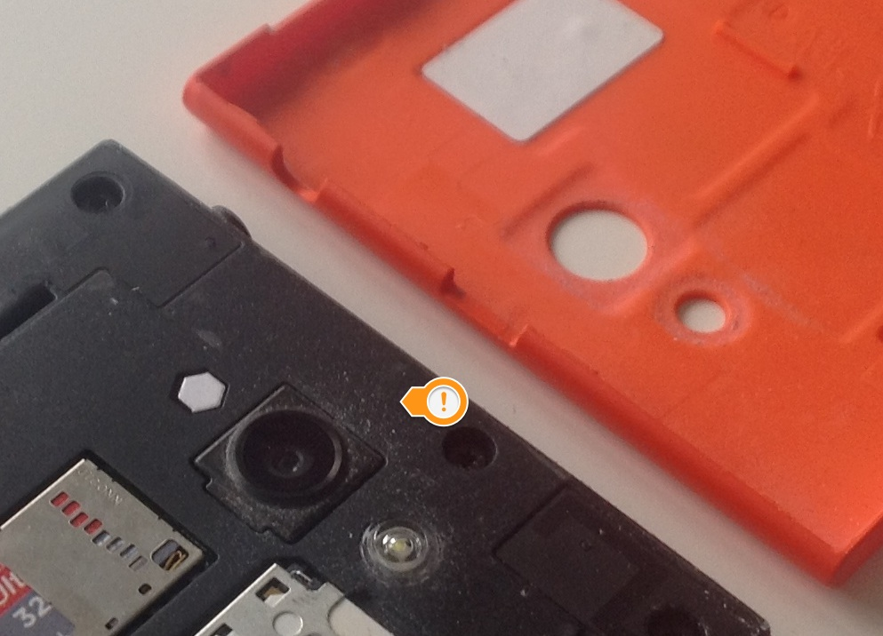
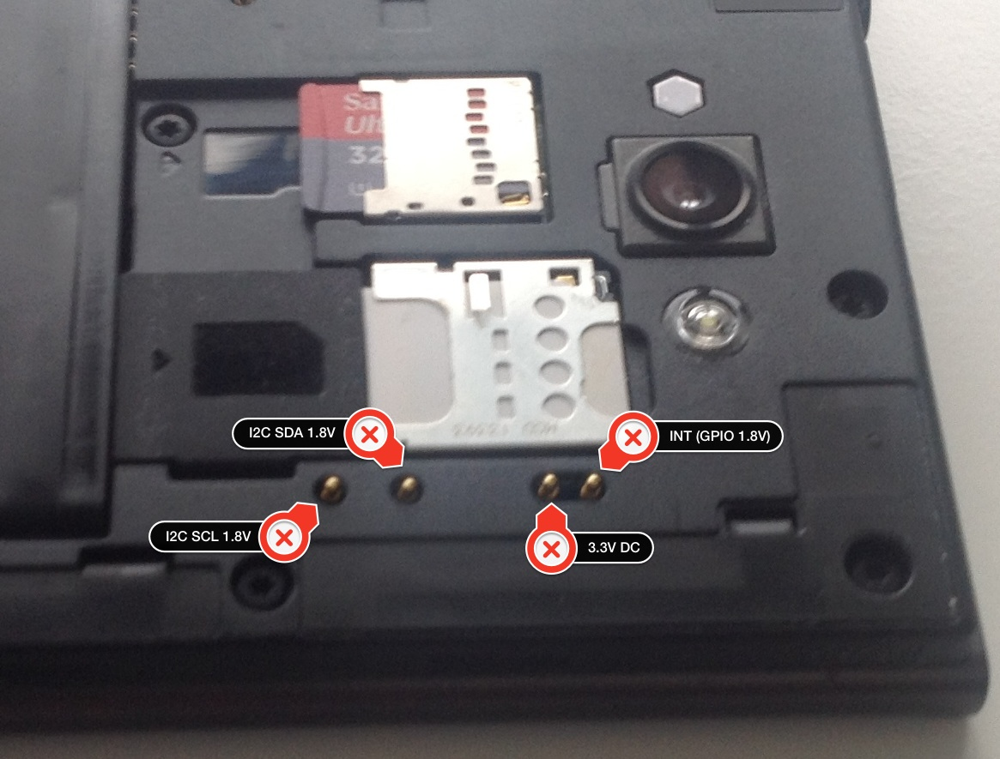
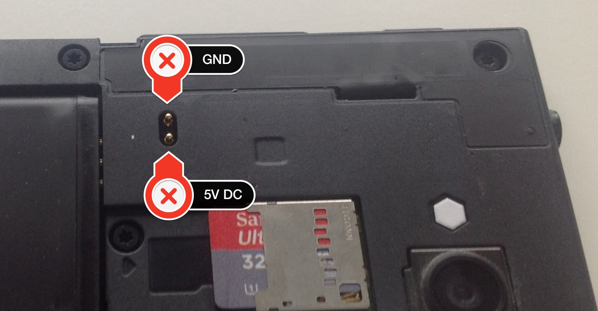
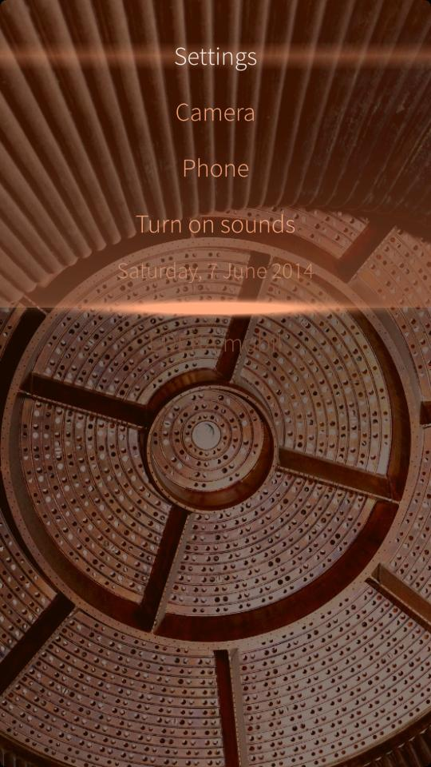
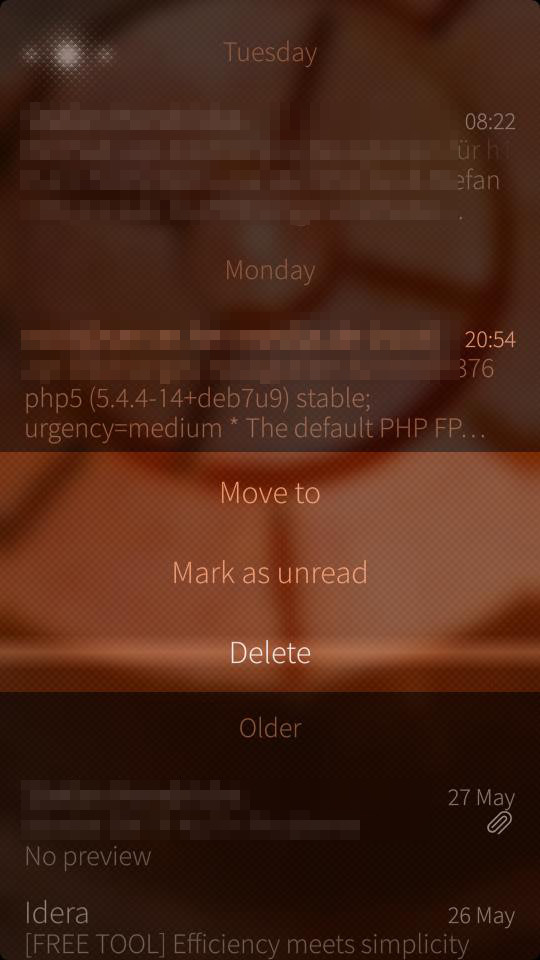

# The carrot and the stick - there are silver linings #

Some days ago I wrote about what I [do not like](./20140601--1.md) regarding my Jolla phone. The tenor of this article was quite negative due to its focus.

But there are also positive aspects in the Jolla universe and I think it's only fair to mention them, too. This is no excuse nor me flinching now. Why should I? But I think of people that may stumble upon this blog unrelated to Jolla and/or SailfishOS (that will be a small number for sure), read that article and come to the conclusion "meh, that guy is all negative". Having only that article to reason, a comprehensible judgement. Maybe it would have been a good idea to give the carrot first and hit with the stick afterwards but I could not resist. Sometime you just can't hold back and I mean that with no dirty hidden agenda. If you got pictures right now, it's all in your mind!

Always...

## ...think of the bright side of life

Here come the features I really like about my Jolla. There will be mixed in some critical comments. Don't worry - not too many. I am just too lazy to update the negative article and I still want to mention it where appropriate.

### Let's get physical

When you open the back side of the Jolla phone, which means to tear of _the other half_, you can see some advantages of the phone:

* a removable battery and
* accessible contacts
* the parts are not glued together
* MicroSD slot

If you look at this first picture, you can also notice a small caveat here: the construction of _the other half_ works like a dust magnet. No real problem at first sight, only the future will tell if little particles work their way through the phone and end up on the rear side of the screen. This is a problem shared by all phones that can be opened by the customer. Even the glued ones have tiny spots where the dust can creep in, like e.g. USB/phone plugs, switches and so on.

Solely the battery in combination with a glued enclosure are two of the main reasons I never even thought about buying a phone from the fruit company. In times of limited resources it's just insane to build a device like that. Yes, building a device that looks good (which clearly lies in the eye of the beholder), _is_ servicable _and_ environmental advanced is a challenge. I'm looking at you Apple!

Must be unkown in Cupertino, though. The MicroSD slot speaks for itself, ask anyone with an iDevice how they expand their memory. Really interesting and promising are the contacts that are accessible and provide a basis for future developments. Not only from Jolla, also from third parties.
Many people miss a QUERTY keyboard, think of all kind of sensors. Only the sky is the limit. OK, more the [I2C bus](http://en.wikipedia.org/wiki/I²C).

[Inductive charging](http://en.wikipedia.org/wiki/Inductive_charging) is just a small step away. The pins are there, so is the pinout. There is [a proof of concept](http://talk.maemo.org/showthread.php?t=92059) out there, it can be just a matter of time before we will have a product on the market. I want one!

### Community work

While I claimed that I am not very happy with the community work from Jolla, I also must admit that they accept and tolerate negative criticism. Even if they do not share your opinion, there is a fair chance that they retweet negative remarks or links to articles. However, they do not retweet everything. My guess is work overload (and truth be told: swallowing the firehose of information swirling in the internet they may also simply miss it) here and I even could understand some resistance. It is surely no fun to share something that is directed against something you worked for with all your heart and love.

### Openness

The moment you activate the developer mode in the _settings app_ you get full access to the phone. Play around with the user `nemo` or elevate yourself to `root` via `devel-su`. Everything is possible, no strings attached. You can edit any file, tweak system settings, install apps from other sources than the _harbour_ store.

*I love that!* 

The only problem I have, is when I _must_ tweak to get basic features (read this as "if I can, it does not mean that I want to"). A phone is - for me - a tool that has to work out-of-the-box. This is not a Raspberry Pi. Period.

Here are some snippets from an [older article](./20131228--1.md) with things that turned out to be good inside the Jolla:

* [x]  <i>Every owner of a phone (or any hardware) should be able to with it what he wants. If I want to write software for that thing, it must be possible without any fees, payments or artificial hoops to jump through.</i>
check!
* [ ]  <i>No limits for developers, which means: a developer should be able to use each and every resource of that phone. That collides with security but I think that can be managed to a certain degree.</i> Not 100% sure yet, but close to check! Don't mix that up with the lack of documentation I have criitized.
* [ ]  <i>Secure way to opt in for all kinds of access levels to the device (see security).</i> So far a check! But that might change in future.
* [x]  <i>Open Source compatible shop / license model(s).</i> check! It can not be stressed enough how important that is: many eco systems have a problem with open source apps their stores. The problem is not so much that you can not publish the source code from your app. The problem is conflicting licenses here. I am really happy about this aspect of the Harbour store.
* [x]  <i>Filesystem access. If you want to be productive, you can't live in an app-centric ecosystem. You often have data, that is used from different apps. There needs to be some common file space where all apps can share data. Blackberry did that and even Microsoft. Again, developers should actively opt in for it.</i> You can access the filesystem and there are already free 3rd party apps to support the user doing so. check!
* [x]  <i>Micro SD card slot (maybe in #theotherhalf)</i> No, it's in the body of the phone, just behind the other half. <i>Class10 capable of course or even better: UHS-II</i> check! But I don't know the max. supported standard.
* [x]  <i>shell (bash or whatever) access (see security) and therefore _ssh_, _scp_ and all that stuff.</i> check!
* [x]  <i>possible shop alternatives without rooting the device.</i> check!
* [x]  <i>Regular security updates, should be no problem in a Linux RPM packaged environment</i> check!

### Android Apps

The emulation layer worked without any flaw. This maybe due to just a few Android apps installed on my phone and I even hardly use them. People that do use them very often or more of them may have another experience, for me it works just fine. Sometime apps are only available in the Google playstore but that is really not Jolla's fault and if you want you can [install the Playstore](:https://together.jolla.com/question/30926/howto-install-google-play/) on your phone. As mentioned above, you can tweak _anything_ here. but beware: the Playstore communicates "behind your back". That may drain your data plan!

*Why is the Playstore not the default store on the phone?* you may ask. I don't now, but legal issues is my guess here. Or money. Sometimes it's even the same.

### UI elements

There are some UI elements that are solved in a brilliant way on the Jolla phone. The first ones that come to my mind are:

The pulley menu is a cool way to have a menu present all the time without wasting much screen real estate. Used for global available actions inside an app it's a nice UI control even usable with one hand only (if your hand is big enough). Should be used sparingly IMHO because it hides the actions from the user.

Could be changing the time more beautiful and simpler than this?

Tapping long on times may reveal a context menu. Solved in a nice and convenient way.

### Is there more?

Yes, there is - these are only the things that came to my mind right away. T.b.c.

### Do I love Jolla now?

That would mean that I've hated Jolla before and that was never the case. There is and was no hate. I have no problems with the company or its employees, the community or fans. That was not [this blog post](./20140601--1.md) was about. Yes, I am disappointed from the product in my hands but that doesn't mean that I think bad about them.

There is certainly a hard working bunch of clever people ruddering in that boat called Jolla.

I want them no harm! Why should I? I want them to have success!

And be it just for the selfish reason of having an update available almost every month for many years to come.