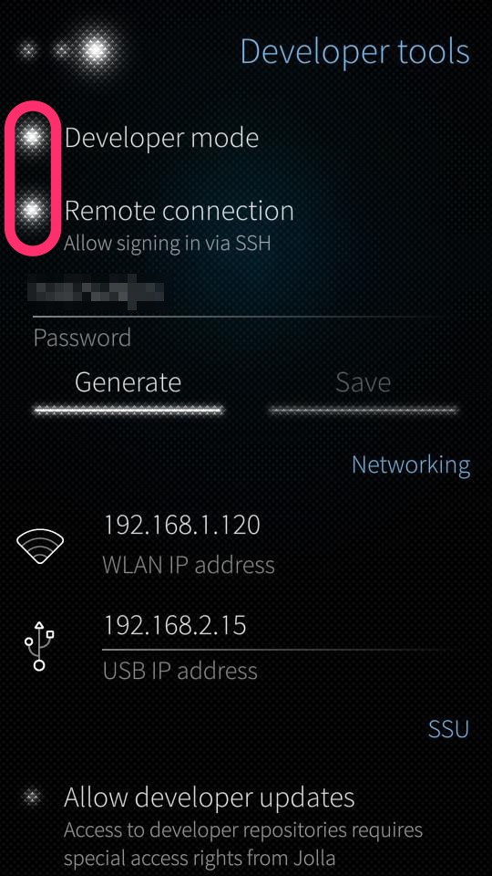
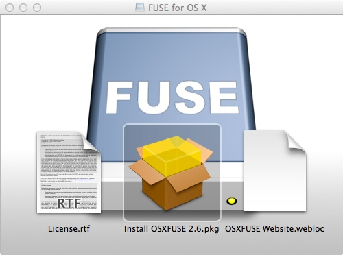
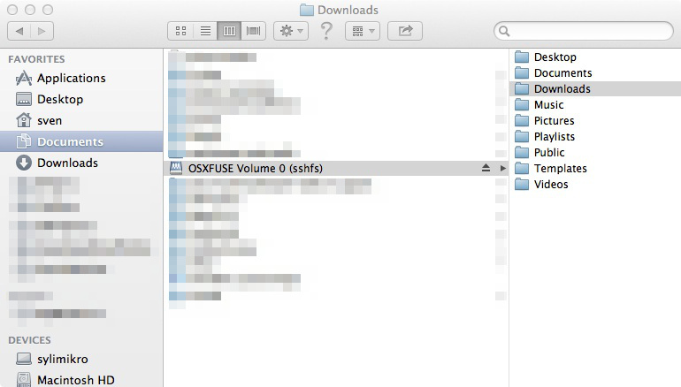
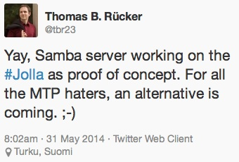

#  FUSE for OSX - mount the little boat #

So you got a Jolla phone and want to access its filesystem. Surprisingly easy with Microsoft Windows, surprisingly complicated with some flavors of Linux and with OSX. Besides that it's a little awkward to connect two computers via USB cable in the year 2014 if both got WLAN. Yes, I can use SSH and the command line or [FileZilla](https://filezilla-project.org/) or any other graphical client software. Works, but is that the easiest way to do it? Remember the reason we use computers at all? It's to automate things. Using the command line may be more efficient in under some circumstances or maybe the only way to achieve your goal. But from the perspective of usability it's not the _easiest_ way to do things. If you are nerd enough to disagree here, just go ahead - there is nothing wrong with that. In other words: using the command line has a very low [WAF](http://en.wikipedia.org/wiki/Wife_acceptance_factor).
There is an entry in [together.jolla.com](https://together.jolla.com/question/41912/why-is-jollasailfish-so-hard-to-connect-to-linux/) that complains about that and there is a hint for a solution: [FUSE](http://en.wikipedia.org/wiki/Filesystem_in_Userspace). On OSX there was a [derivative](http://code.google.com/p/macfuse/) called MacFUSE which I've used some years ago to mount NTFS partitions. But I recalled that it was not maintained anymore.
Well, there is a successor for some time now, called [FUSE for OSX](http://osxfuse.github.io). I did not use it so far but that's something that's easy to change.

Let's see if we can take it for a walk into the Jolla / SailfishOS filesystem.

Before we start, you need to activate _Developer Mode_ and allow _SSH connections_. Since the user `nemo` is preset and the same on all Jolla devices, anybody could log in your phone. At least when you are in some kind of public network. Choose a password that matches your personal level of paranoia.



The password generator here is just a tool to help you to get in. Once your in the shell you can set any password with any complexity you want.


## Download and install

Head over to the "project homepage", download the installer, double click on the .DMG file to mount the disk image and afterwards double click the package installer.



You will need administrator rights to install it because it's not just an application that can be deployed via xcopy deployment. It will install a driver and thus needs some more rights to get hooked into the OS. Users of Microsoft Windows would feel instantly at home because they are used to installers and their _next_, _next_, _yes I want_, _yes I really want to_, _finish_ dialogs. Better pay attention at the right moment and check the box next to the _OSXFUSE Preference Pane_ option.

### What happened?

If you really want to know what was installed where (this may be handy if you want to remove the whole thing), look via terminal:

```
pkgutil --files com.github.osxfuse.pkg.Core
# and / or
pkgutil --files com.github.osxfuse.pkg.PrefPane
```

Being forced to uninstall via terminal knowledge is one of the oddities of the OSX operating system. Just think of the target audience, how shall they ever get rid of software like this?

The creators of FUSE for OSX thought about that and have an _uninstall_ option in the preferences pane. So you really better install that one, too.

### [And then?](http://www.youtube.com/watch?v=GKNX6dieVcc)

So far we got only the basic ingredients to mount filesystems in user space. Now, let's march on and look out for the filesystem itself. Download the [installer package from the project homepage](https://github.com/osxfuse/sshfs/downloads) and double click


the installer. You will need administrator rights again for the same reasons, just click the default options - it's pretty straight forward.


### WWIW?

The _what was installed where?_ question can also be answered via terminal / command line:

```
pkgutil --files com.github.osxfuse.pkg.SSHFS
```


## Take it for a ride

So now everything is installed and just one simple question remains. How do I use this software? We did this to make life easier, didn't we? Ok, it's _I_ and not _we_.

First make sure that your Jolla phone always gets the same ip address from your router. Look out for something named [DHCP](:http://en.wikipedia.org/wiki/Dynamic_Host_Configuration_Protocol) reservation. Then we need a place where the remote filesystem can be mounted into. I've created a directory `~/Documents/sshfs.nemo`. Any (local) name and / or place will do, as long as you can access it from your machine and with your account.

Open the terminal and enter

```
sshfs nemo@192.168.1.120: ~/Documents/sshfs.nemo/
nemo@192.168.1.120's password:
```

The filesystem will be mounted and you can access it with the Finder application.



Now all the files in your `nemo` user home directory can be access via Finder / OSX GUI. There's a little caveat here: sometimes the Jolla phone sleeps so deep that you won't get a connection. It can be woken up if you `ping` it in a second terminal window. Right now I have not tested it, but I can imagine strange situations if you change a file from inside the phone and the Finder not reflecting that change.


## Nice, but how's that easier?

So far this is just _another way_ of connecting to the device. Once it's done, it blends in pretty well. To get there is not very convenient (always from the perspective of an OSX user that does not want to go in all those details). There [is a GUI](:http://code.google.com/p/sshfs-gui/) available to do the job of mounting the remote filesystem. AFAIK it's based on the elder MACFUSE.

Right now I am thinking of using the _Automator_ and _Keychain Access_ or _public key file_ to build a little icon that does the job for me. But it's summertime, very hot out there -  life is calling. This must stay t.b.c.


## Dancing queen

If you have a look at this tweet,



you may put on your dancing shoes in a future not so far away and connect to the phone really easy.