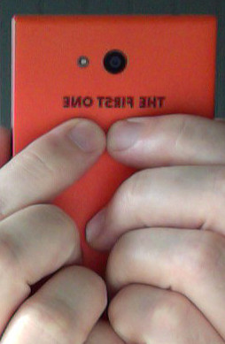
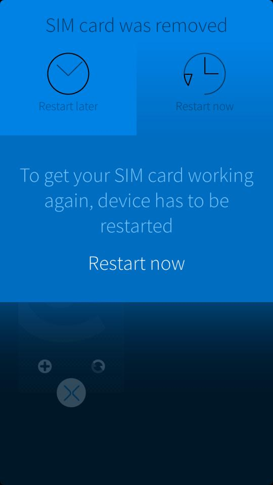
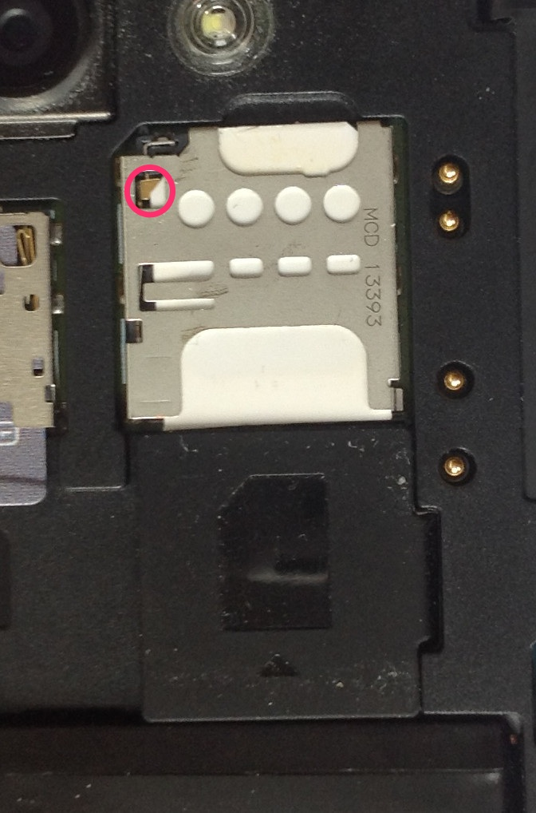
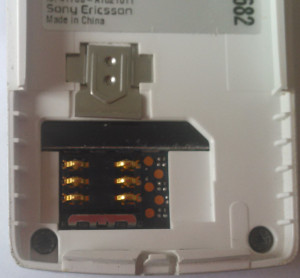
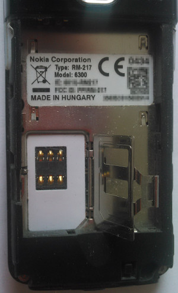

# Ding dong - the switch is dead #

You've been floating around in the realms of the internet and read some articles about the [SIM](:http://en.wikipedia.org/wiki/Subscriber_identity_module) card holder problem that allegedly afflicted some Jolla phones. Allegedly? If only this was true! Let's see if you are in the boat as well. Press with the fingers on the backside of _The Other Half_, a tiny bit beneath the camera, like so

If you cropped a message like this here,

congratulations, you're in.
_But who is gonna squeeze the phone like this?_ you may ask. And you are right. But think of the phone being in the front pockets of your pants. For me the only place to put this huge thingy. When you sit down there will be tension and other forces on the back cover of your beloved device. This may lead one day to a similar situation where pressure is happening at the right place and the Jolla looses contact to the SIM card.

## What's happening here?

If you look on the SIM card holder from above you will notice a tiny little switch.

Once this switch turns off, the Jolla phone gets the signal that the SIM card is gone - even if it's still in the tray. There is a nice picture on [Twitter](https://mobile.twitter.com/KaaczM/status/467271505186160641/photo/1) explaining the root cause in detail, so I am not even trying to draw a better picture.  By the way: if the switch gets contact again, you will be asked for the SIM card PIN and everything works again - no reboot needed.

As you can see in the picture above I am using a self cut SIM card. In the beginning it was stuck like concrete but now it tends to move in tiny little steps. Well, it doesn't really exactly fit in the tray, does it?

## And Jolla?

You could say there is an [answer](https://together.jolla.com/question/1358/sim-card-connection-to-phone-lost-easily/) on TJC and a solution: send your phone in to Jolla Care. But does that [really help](https://www.mail-archive.com/devel@lists.sailfishos.org/msg04180.html)?

## And now what?

The first thing that came to my mind was _why is there a switch at all?_ I remembered some older phones from me and they all came without such extra stuff.

However, there is a difference: in all those phones the SIM card tray was beneath the battery and that made pretty sure that you turned your phone off before you started fingering around with the SIM card. Maybe it's a design to protect the card (or the phone) by switching off the current when the card is moved but still on the little contact surfaces. The only device which could be similar in our home is an iPad and there is everything hidden inside the glued black box. Since the SIM card lies flat in its drawer there must be some kind of electric eye inside the iPad to get the same behavior. But: nothing to see.

Another reason could be power consumption: a simple on / off switch connected to an interrupt line is easier to handle and should use less power than a periodically initiated software probe asking _is there a SIM?_ _Is there a SIM?_ _Is there a SIM?_ ...

Anyhow, that's all pure speculation. Only Jolla can answer that. If someone of them reads this and knows the answer: please drop me a line.

### hardcore solution #1

Switch? What switch? If you are like me and always use the phone with a SIM card and are pedantic enough to really switch the phone off before you change the SIM, there is no need for the switch. There is and will always be a SIM card inserted. Let's do this in hardware. Open the phone, use a multimeter to find the right joints and to get the right logic: is it an off-on or on-off switch?  If you trust your soldering skills make a short connection between those two or cut the conductive part - depending on the logic. I am - at least right now - not desperate enough.

### softcore solution #2

If the switch can't move, it can't change it's state. Glue it (when it's in the right position)!

### softcore solution #3

Use some plastic splinters to force the SIM card against the switch.

Personally I think I will go for #2 but I will wait until it gets really painful. Right now the phone looses the SIM card every 4 week or so.

_Disclaimer This information is distributed in the hope that it will be useful, but WITHOUT ANY WARRANTY; without even the implied warranty of MERCHANTABILITY or FITNESS FOR A PARTICULAR PURPOSE._ 
