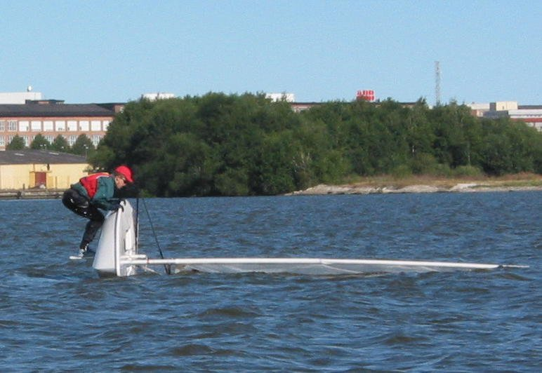

# 20140803 - Farewell Jolla

It has been an open secret that I am [not very happy with my Jolla phone](./20140601--1.md). I really wish Jolla success and hope they will stay on the market! Maybe I will come back again, only time and less bugs will tell.

But right now I have come the conclusion that I bother much too often with the phone and its limitations. It never happened before that a phone managed to sink in this way. A phone is a tool and as a tool it simply has to work and stay out of my consciousness.

Even after 8 months of use it fails in simple things like a synced address book and calendar. Lucky me that I use it only as a private person! I need a workhorse and not a bitchy Cinderella.

Enough.

Period.

Good bye!