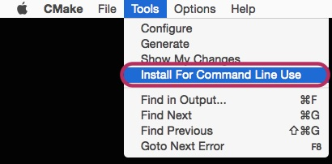

# Build cmake command-line tool on OSX #

Download source code from [the cmake homepage](http://www.cmake.org/download/).
Open the terminal and enter

```
cd <folder with source code>
./bootstrap
make
sudo make install
```

The result will be in `/usr/local/bin/cmake`. If you want to use the Gui, I recommend downloading the pre-build package unless you really want to install Qt 4.x on your Mac. If you have an older version in `/usr/bin` and are willing to overwrite it, you can compile with

```
cd <folder with source code>
./bootstrap --prefix=/usr
make
sudo make install
```

Do not throw away the source/build directory, you may want to call `sudo make uninstall` later on.
Or you could simply download the prebuilt Gui application and create some symbolic links from there.

