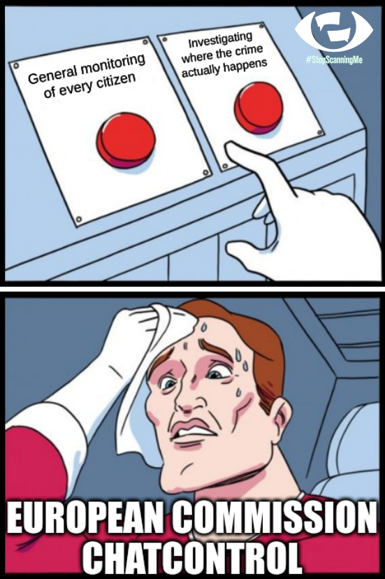

# Dude where is my privacy?

During the easter weekend I watched the Chaos Computer Club talk [EH20 Chatkontrolle - Mehr Überwachung für alle](https://www.youtube.com/watch?v=NNBKh96OcHU) from [khalesicodes](https://mas.to/@khaleesicodes@eupolicy.social) AKA Elina Eickstädt about plans in the EU to create new laws that lead to surveillance on the phones of each and every citizen in the EU.

I've heard about those plans before and only knew that the fight against child abuse is the sales pitch here. To make things absoultely clear: child abuse is horrific and words fail me here even thinking about it.

But putting every citizen in the EU under general suspicion cannot be the solution here.

As is so often the case with political developments you can't comprehend is to follow the trail of money. The actor [Ashton Kutcher](https://en.wikipedia.org/wiki/Ashton_Kutcher) is not only an actor but also very invested in some high tech companies and/or startups.

He used [Twitter](https://www.spiegel.de/politik/deutschland/ashton-kutcher-und-saskia-esken-hollywoodstar-sucht-dialog-mit-spd-chefin-a-b103a68c-15f4-4507-b35c-e720873c6ff5) to contact german politicians and is [lobbying in the EU](https://www.derstandard.at/consent/tcf/story/2000135697549/was-ashton-kutcher-mit-dem-eu-plan-fuer-messenger-ueberwachung) for [more surveillance](https://netzpolitik.org/2022/dude-wheres-my-privacy-how-a-hollywood-star-lobbies-the-eu-for-more-surveillance/).

To quote the last post:

> The draft law, [unveiled yesterday in Brussels](https://ec.europa.eu/commission/presscorner/detail/en/IP_22_2976), does not specify which technology must be used. Privacy advocates fear that in practice, the law could mean that most services will have to use client-side scanning, an intrusive technology that circumvents end-to-end encryption.
> 
> (...)
> 
> With Thorn, Kutcher entered the market for surveillance technology (...) To EU institutions, Thorn presents itself [as a charity organization](https://ec.europa.eu/transparencyregister/public/consultation/displaylobbyist.do?id=854246640306-96) that fights against child abuse. Meanwhile, the organization repeatedly brought up its proprietary child abuse tracking software in meetings with EU officials.

Bummer!

This is wrong on so many levels, I can't express my anger and the feeling of powerlessness right now.

Make your voice be heard, please join the **#StopScanningMe** campaign by [edri](https://civicrm.edri.org/stop-scanning-me).

